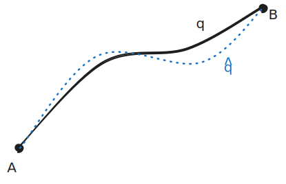
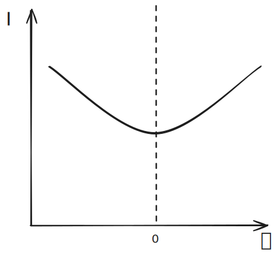

# Calculus of Variations

**Functionals** are functions of functions:

$$D(f) \tag1$$

where $f$ is a function and $D$ is a functional. We could imagine that $D$ gives the distance along some function $f$. 

In traditional calculus, functions map from $\mathbb R$ to $\mathbb R$; now, functionals map from functions to $\mathbb R$. 

Now, imagine we are trying to minimize the distance functional $D(f)$ . We are looking for a function $f$ that will yield the lowest distance. In this example, we could express the functional as a line integral.

$$D(f) = \int \limits_{t_1}^{t_2} \;ds = \int\limits_{x_1}^{x_2} \sqrt{1+f'(x)^2}\;\; dx $$

Generally, the *primary objective of variational calculus* is to find some function $F$ such that $I[f]$ is minimized.

$$I[f] = \int\limits_{x_1}^{x_2} F(x, f(x), f'(x))\; dx \tag2$$
^eq-2

> $I$ is a functional of f

This function $F$ is called a Lagrangian. You can see how this [eq. 2](#^eq-2) is the exact same format as the [Principle of Least Action](Lagrange's%20Equations.md#^eq-1). 

### Deriving Euler-Lagrange Equation

Let an idealized function $q(t)$ be the optimized path to minimize the following:

$$I[q] = \int \limits_{t_0}^{t_1}F(t, q, \dot q)dt$$

We can make this path **unoptimized** by adding **variation** to it. We'll add an *arbitrary function* $\delta q(t)$ to the function times some scalar $\epsilon$.

$$\hat q = q+\epsilon \cdot \delta q \tag3$$
^eq-3

$\hat q$ is our new unoptimized path, shown below:



%%[🖋 Edit in Excalidraw](../../media/excalidraw/excalidraw-2024-12-10-23.24.19.excalidraw.md)%%

Note that the **variation is arbitrary**, the value of $\delta q$ does not matter, so long that it is nonzero and satisfies the condition that:

$$\delta q (t_0) = \delta q(t_1) = 0 \tag 4$$
^eq-4

We can see what this means geometrically in the figure above; in order for $\hat q$ to share the same endpoints as $q$, $\delta q$ must shrink to zero at both endpoints.


We can write the lagrangian for this new function $\hat q$:

$$I[\hat q] = \int\limits_{t_0}^{t_1} F(t, \hat q, \dot {\hat q})dt \tag 5$$
^eq-5

From the relationship in [eq. 3](#^eq-3), we can see that, if we were to parameterize $I[\hat q]$ in [eq. 5](#^eq-5) we would get a relationship like:


%%[🖋 Edit in Excalidraw](../../media/excalidraw/excalidraw-2024-12-14-16.55.55.excalidraw.md)%%

The lowest value $I[\hat q]$ will come where $\epsilon = 0$. This point is also critical, where $\frac{dI[\hat q]}{d \epsilon}=0$. So, knowing this, let's take the derivative of [eq. 5](#^eq-5) with respect to $\epsilon$:


$$\frac{d I[\hat q]}{d\epsilon} |_{\epsilon \to 0}=0= \frac{d}{d \epsilon} \int \limits _{t_0}^{t_1} F(t, \hat q, \dot{\hat q})  dt \tag 6$$
^eq-6
Then, we can use the [Leibniz Rule](https://www.youtube.com/watch?app=desktop&v=wkh1Y7R1sOw), which states that...

$$\frac{d}{dt}\int\limits_{a}^{b}f(x)\ dx = \int\limits_{a}^{b} \frac{\partial}{\partial t} f(x)\ dx$$
..., to move the $\frac{d}{d \epsilon}$ in [eq. 6](#^eq-6) into the integral to get:

$$0 = \int\limits _{t_0}^{t_1} \frac{\partial}{\partial \epsilon}  F(t, \hat q, \dot{\hat q}) dt \bigg |_{\epsilon \to 0} = \int\limits _{t_0}^{t_1} (\frac{\partial F}{\partial t} \cdot \frac{\partial t}{\partial \epsilon} + \frac{\partial F}{\partial \hat q} \cdot \frac{\partial \hat q }{\partial \epsilon} + \frac{\partial F}{\partial \dot{\hat q}}\cdot \frac{\partial \dot{\hat q}}{\partial \epsilon} ) \bigg |_{\epsilon \to 0} \ dt \tag 7$$
^eq-7

There are a few things to notice here. Firstly, $\partial t / \partial \epsilon = 0$ because $t$ is independent of $\epsilon$. Secondly, we can derive expressions for ${\partial \hat q}/{\partial \epsilon}$ and ${\partial \dot{\hat q}}/{\partial \epsilon}$  from [eq. 3](#^eq-3). 

If we derive [eq. 3](#^eq-3), we get:

$$\dot {\hat q} = \dot q + \epsilon \cdot \delta \dot q \tag 8$$
^eq-8

Then, by differentiating [eq. 3](#^eq-3) and [eq. 8](#^eq-8) with respect to $\epsilon$, we'll get:

$$\frac{\partial \hat q}{\partial \epsilon}=\delta q \text{\;\;\;and\;\;\;} \frac{\partial \dot{\hat q}}{\partial \epsilon} = \delta \dot q \tag 9$$

By substituting these values into [eq. 7](#^eq-7), the expression becomes:

$$0 = \int \limits _{t_0}^{t_1} (\frac{\partial F}{\partial \hat q}\cdot\delta q+\frac{\partial F}{\partial \dot{\hat q}}\cdot \delta \dot q) \bigg |_{\epsilon \to 0} dt \tag {10}$$

Now, notice that as $\epsilon \to 0$, we see $\hat q \to q$ ? If we say that $\epsilon = 0$, we can replace these values of $\hat q$ and $\dot {\hat q}$ with $q$ and $\dot q$ respectively.

$$0 = \int \limits _{t_0}^{t_1} (\frac{\partial F}{\partial q}\cdot\delta q+\frac{\partial F}{\partial \dot{ q}}\cdot \delta \dot q) \bigg |_{\epsilon = 0} dt \tag {10}$$
^eq-10

This is a valid substitution because we know the LHS will only actually equal zero at $\epsilon = 0$. 

This [eq. 10](#^eq-10) is known as the **weak form** of the first variation of $F$. This is the weak form because an $\delta \dot q$ still appears, instead of just a $\delta q$. 

Using **integration by parts**, we can turn [eq. 10](#^eq-10) into its strong form. First, we'll break the integral apart at its addition operator:

$$0 = \int \limits _{t_0}^{t_1} \frac{\partial F}{\partial q}\cdot\delta q \ dt +\int \limits _{t_0}^{t_1}\frac{\partial F}{\partial \dot{ q}}\cdot \delta \dot q \ dt $$

Let's isolate the rightmost integral:

$$\int \limits _{t_0}^{t_1}\frac{\partial F}{\partial \dot{ q}}\cdot \delta \dot q \ dt$$

This lets us define $u=\frac{\partial F}{\partial \dot q}$ and $dv = \delta \dot q \;dt$, such that $v = \int dv = \delta q$ . We can also see that $\frac{du}{dt}=\frac{d}{dt}(\frac{\partial F}{\partial \dot q})$  such that $du = \frac{d}{dt}(\frac{\partial F}{\partial \dot q})dt$ .

Then, by integration by parts, we can say:

$$\int \limits _{t_0}^{t_1}\frac{\partial F}{\partial \dot{ q}}\cdot \delta \dot q \ dt = \frac{\partial F}{\partial \dot q } \cdot \delta q \bigg |_{t_0}^{t_1} - \int \limits_{t_0}^{t_1} \delta q \cdot \frac{d}{dt}(\frac{\partial F}{\partial \dot q})\ dt $$

The $\frac{\partial F}{\partial \dot q } \cdot \delta q \bigg |_{t_0}^{t_1}$ term will evaluate to zero because $\delta q (t_0) = \delta q(t_1) = 0$, as was established in [eq. 4](#^eq-4). This means we can reduce the expression to:

$$\int \limits _{t_0}^{t_1}\frac{\partial F}{\partial \dot{ q}}\cdot \delta \dot q \ dt =  - \int \limits_{t_0}^{t_1} \delta q \cdot \frac{d}{dt}(\frac{\partial F}{\partial \dot q})\ dt $$

Now, we can finally substitute this expression back into [eq. 10](#^eq-10):

$$0 = \int \limits _{t_0}^{t_1} \left( \frac{\partial F}{\partial q} \cdot \delta q \ - \delta q \cdot \frac{d}{dt}(\frac{\partial F}{\partial \dot q})\right)\ dt = \int \limits _{t_0}^{t_1} \delta q(\frac{\partial F}{\partial q}- \frac{d}{dt}(\frac{\partial F}{\partial \dot q}))=0 \tag {11} $$

Remember, $\partial q$ is **arbitrary**; it can take on whatever value so long that it abides by the boundary conditions. For this reason, in order for the integral to evaluate to zero, we know that the other factor $\frac{\partial F}{\partial q}- \frac{d}{dt}(\frac{\partial F}{\partial \dot q})$ is what must evaluate to zero. Therefore, we can pull this out of the integral and state:

$$\frac{\partial F}{\partial q}- \frac{d}{dt}(\frac{\partial F}{\partial \dot q}) = 0$$
^euler-lagrange

This is the **Euler-Lagrange Equation**, which is a fundamental relationship in mechanics with even more applications in other fields.


### References

```vid
https://www.youtube.com/watch?v=SQLxrr9N8zM
```

```vid
https://www.youtube.com/watch?v=VCHFCXgYdvY&t=633s
```

