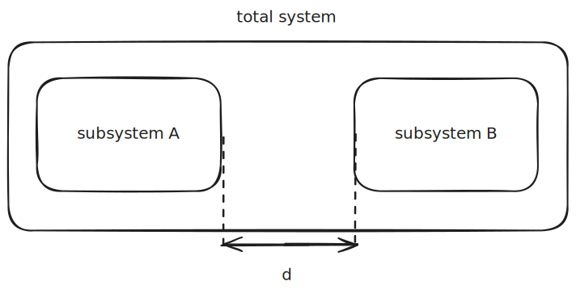

# Lagrange's Equations

Equations of Motion:  
Chapter 1 in [Landau-Lifshitz Course on Mechanics](Landau-Lifshitz%20Course%20on%20Mechanics.md)

---

A **particle** is a fundamental concept in mechanics; it is a *body* with *neglected dimensions*. Whether or not an object can be treated as a particle depends on the situation.

We can describe the position of a particle in space by its "*radius vector*" $\textbf r$, which comprises the x, y, and z Cartesian coordinates.

The first-order time derivative of the particle, i.e., $\textbf v = \frac{d \textbf r}{dt}$, defines the *velocity* of the particle, and the second-order time derivative defines the *acceleration* of the particle.

To define a system of $N$ particles, $N$ radius vectors are requisite. This value $N$ is the number of *degrees of freedom*. So, for instance, a system of 5 particles will have 5 degrees of freedom.  
> 🤖 (notecheck comment) - Typically, a system of 5 particles in three-dimensional space has 15 degrees of freedom if unconstrained. Possibly, you are referencing a one-dimensional scenario or assuming constraints; otherwise, 5 degrees of freedom is not generally correct.

Any set of $s$ quantities that define the positions of particles in a system with $s$ degrees of freedom are called **generalized coordinates**. Say $q_1, q_2, q_3, \dots, q_s$ are these quantities; their time derivatives, i.e. $\dot q_s$, are their **generalized velocities**. 

If you know $q$ and $\dot q$ at a given moment, along with the force function $F(q, \dot q)$, you can extrapolate to solve for future states in the system. The motion of the particle(s) is determined. 

> There's a chance I'm wrong here. The book makes no mention of the necessity to know the function $F$, but I cannot imagine how a system can be deterministic without knowledge of the force field it is subject to.

### The principle of least action

This is sometimes called **Hamilton's Principle**, where we say that there exists a function $L$ such that the integral between two moments $t_1$ and $t_2$ yields the least possible value:

$$ S = \int \limits_{t_1}^{t_2} L(q, \dot q, t)\ dt \tag1$$
^eq-1

This function $L$ is the **Lagrangian** of the system, and the integral is called the **action**. 

#### Deriving Minimum Action

Assume a system of one DOF satisfies [eq. 1](#^eq-1). Let $q = q(t)$ be the position function for which the action is minimized.

If instead we defined $q$ as,

$$q = q(t) + \delta q(t) \tag2$$
^eq-2

the action $S$ would increase. $\delta q(t)$ is called the *variation* of the function $q(t)$. We can measure the increase in $S$ by plugging this new definition of $q$ back into [eq. 1](#^eq-1). This gives the change

$$ \int \limits_{t_1}^{t_2}L(q+\delta q, \dot q + \delta \dot q, t) \ dt - \int \limits_{t_1}^{t_2}L(q, \dot q, t)\ dt $$

which simplifies to:

$$\delta S = \delta \int \limits_{t_1}^{t_2} L(q, \dot q, t) \ dt = 0 \tag3$$
^eq-3

This is saying that the first variation needs to be zero. This is another way of expressing the principle of least action.

If we expand the equation above, we can rewrite this as:

$$0 = \int \limits_{t_1}^{t_2} \left(\frac{\partial L}{\partial q}\delta q + \frac{\partial L}{\partial \dot q}\delta \dot q\right) \ dt $$

Integrating by parts and removing the zeroth-order term from the integral yields:

$$\delta S = \begin{bmatrix}\frac{\partial L}{\partial \dot q}\delta q \end{bmatrix}_{t_1}^{t_2}  + \int \limits_{t_1}^{t_2} \begin{pmatrix} \frac{\partial L}{\partial q} - \frac{d}{dt} \frac {\partial L}{\partial \dot q} \end{pmatrix} \delta q \ dt = 0 \tag4$$
^eq-4

If we say that at $t_1$, $q$ is the set of coordinates $q^{(1)}$, and at $t_2$, $q$ is *the set of coordinates* $q^{(2)}$, then the following must be satisfied:

$$p(t_1) = p^{(1)} \text{\;\;\;and\;\;\;} p(t_2) = p^{(2)}$$

Therefore, if $q$ is defined by the equation in [eq. 2](#^eq-2), it must also be true that:

$$\delta q(t_1) = \delta q(t_2) = 0 \tag5$$
^eq-5

in order to satisfy the equation prior. 

We can use this relationship and substitute it into [eq. 4](#^eq-4) to see that the integrated term will expand to zero:

$$\begin{bmatrix} \frac{\partial L}{\partial \dot q}\delta q \end{bmatrix}^{t_2}_{t_1} = \begin{bmatrix} \frac{\partial L}{\partial \dot q}  \end{bmatrix}^{t_2}_{t_1}\cdot  \begin{bmatrix} \delta q \end{bmatrix}^{t_2}_{t_1} = \begin{bmatrix} \frac{\partial L}{\partial \dot q}  \end{bmatrix}^{t_2}_{t_1}\cdot(\delta q(t_2)-\delta q(t_1)) = 0$$

Therefore, we know that the integral in [eq-4](#^eq-4) must evaluate to zero for all values of $\delta q$:

$$\int \limits_{t_1}^{t_2} \begin{pmatrix} \frac{\partial L}{\partial q} - \frac{d}{dt} \frac {\partial L}{\partial \dot q} \end{pmatrix}\ \delta q \ dt = 0$$

Note that we cannot immediately assume that $\delta q$ will equal zero for all $t$ just because [eq-5](#^eq-5) asserts that the *endpoints* will equal zero. We can, however, say that if the factor prior to $\delta q$ is zero, then the principle of least action will be satisfied. We can express this mathematically by pulling the factor out of the integral:

$$\frac {\partial L}{\partial q} - \frac{d}{dt} \left(\frac{\partial L}{\partial \dot q}\right) = 0 \tag6$$
^eq-6

In this context, $q$ represents a *set* of coordinates. We can generalize [eq. 6](#^eq-6) by breaking it apart into its $s$ constituent degrees of freedom. I'll also flip the signs to match the book's notation.

$$\frac{d}{dt}\left(\frac{\partial L}{\partial \dot q_i}\right) - \frac{\partial L}{\partial q_i} = 0 \tag7$$
^eq-7

This equation is called *Lagrange's Equation*. If the *Lagrangian* is known for a mechanical system, [eq. 7](#^eq-7) will yield the relationships of coordinates, velocities, and accelerations. 

The derivation of this is described in more detail in [Deriving Euler-Lagrange Equation](Calculus%20of%20Variations.md#Deriving%20Euler-Lagrange%20Equation). 

#### Summing Lagrangians

[Equation 7](#^eq-7) is a second-order partial differential equation. For this reason, the general solution contains $2\cdot s$ arbitrary constants; two for each physical degree of freedom. These arbitrary constants can be determined in a few ways, one of which is knowledge of coordinates and velocities at a given instant.

Consider the following system, comprised of two subsystems A and B:

%%[🖋 Edit in Excalidraw](../../media/excalidraw/excalidraw-2024-12-10-22.36.03.excalidraw.md)%%

We can express the total Lagrangian, provided that the two systems are sufficiently far apart such that the interaction between the two can be neglected, as:

$$\lim _{d \to \infty} L = L_A+L_B \tag8$$
^eq-8

The author says:

> It is evident that the multiplication of the Lagrangian of a mechanical system by an arbitrary constant has no effect on the equations of motion. From this, it might seem, the following property of arbitrariness can be deduced: the Lagrangians of different isolated mechanical systems may be multiplied by different arbitrary constants. The additive property, however, removes this indefiniteness, since it admits only the simultaneous multiplication of the Lagrangians of all the systems by the same constant.

*The way I interpret this* is that, if we leave $c_1L_A$ and $c_2L_B$, the constants remain unconstrained; by adding [eq. 8](#^eq-8), we constrain the values that $c_1$ and $c_2$ can take on. Without [eq. 8](#^eq-8), varying a $c$ would proportionally vary the action, meaning that there would be no effect on the equations of motion. To remain satisfactory with the additive property, both Lagrangians must **share the same constant**—i.e., $c_1 = c_2$. 

> Coming back from [Galileo's Relativity Principle](Galileo's%20Relativity%20Principle.md), we can think of the ability to multiply the Lagrangian by an arbitrary constant without changing the equations of motion as simply changing the mass in $L=\frac{1}{2}mv^2$. If $m'=2m$, the laws of physics would remain unchanged.

#### Varied Lagrangians

Say we have a second Lagrangian $L'$ which varies from $L$ by some time derivative of a function $f$:

$$L'(q, \dot q, t) = L(q, \dot q, t) +\frac{d}{dt} f(q, t) \tag9$$
^eq-9

We can find the action of $L'$ with:

$$S'\ = \int \limits_{t_1}^{t_2} L'(q, \dot q, t)\ dt = \int \limits_{t_1}^{t_2} L(q, \dot q, t)\ dt + \int \limits_{t_1}^{t_2} \frac{df}{dt} dt =  S+f(q^{(2)}, t_2) -f(q^{(1)},t_1)$$

Because this added term will be zero upon variation (because it is sampled at points $t_1$ and $t_2$), we can say that $\delta S' = \delta S = 0$. This reveals that *the Lagrangian is not uniquely defined to a single system*; instead, it applies to a family of systems that differ only by a function of the *total time derivative* (not the partial derivative) of a function of *coordinates and time*.

> I'm not sure mathematically how you would obtain a total time derivative from a function of both time and another variable. I suppose that, because $q$ is dependent on time, you could