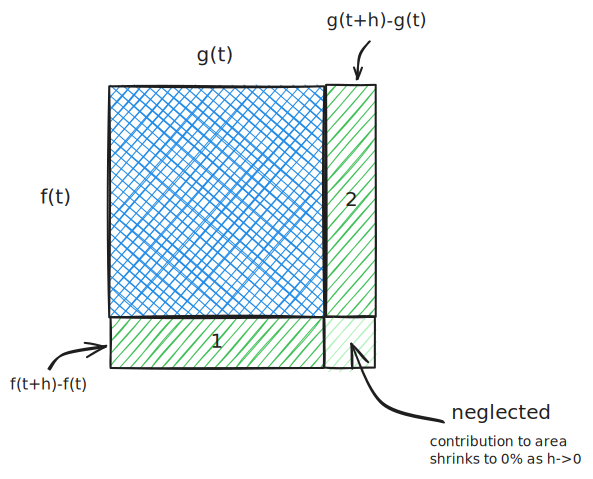
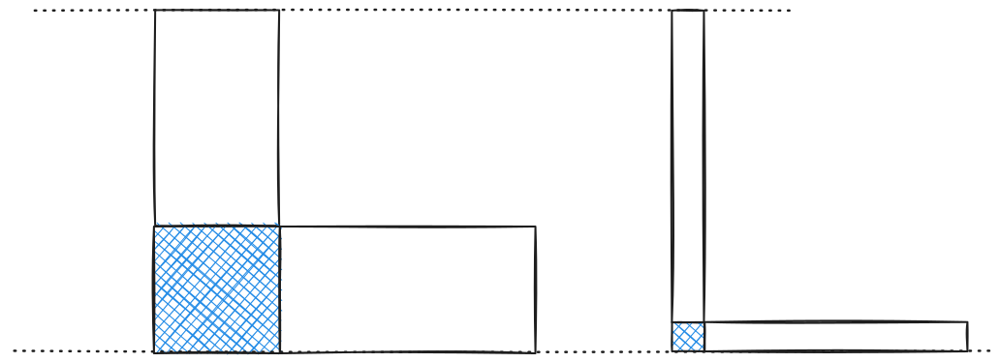

# Product Rule

A product is an area. If the sides to the shape are functions $f(t)$ and $g(t)$, then the area is $A=f(t)g(t)$

%%[🖋 Edit in Excalidraw](../../../media/excalidraw/excalidraw-2025-01-13-22.22.46.excalidraw.md)%%

Now, when we vary $t$, the area changes (shown in green). There are three partitions in this model, but we neglect the smallest one. Here's why:

Imagine I am building an L-shaped object:

%%[🖋 Edit in Excalidraw](../../../media/excalidraw/excalidraw-2025-01-13-22.41.22.excalidraw.md)%%

Even if the lengths stay the same, as the thickness approaches zero, the percent of the total area that this corner piece makes up approaches zero much quicker than the other areas. For this reason, we can neglect it.

Let's now look at the two other partitions, labeled 1 & 2. We can etpress the area of these mathematically as:

$$A_1=\big( f(t+h)-f(t) \big)g(t)$$

$$A_2=\big( g(t+h)-g(t) \big)f(t)$$

We can see some resemblance to the limit definition of derivatives from this. The limit definition of derivatives is:

$$\frac{df}{dt}=\lim_{h\to0}\frac{f(t+h)-f(t)}{h} \tag1$$

--- 

Stop to think about what this is. We advance $f(t)$ by $h$, then normalize the difference using $h$ to get the slope (rise over run). However, this step $h$ that we are doing *is* $dt$ after approaching 0. Hence, we could write the limit definition instead as:

$$\frac{df}{dt} = \frac{f(t+dt)-f(t)}{dt} \tag2$$

And, then by *multiplying* by $dt$, we get a definition for $df$, which is exactly what we see in the area equations above.

$$df = f(t+dt)-f(t) \tag3$$

While we're here, we an preform another operation to define $df$:

$$\frac{df}{dt}=\lim_{h\to0}\frac{f(t+h)-f(t)}{h} = f'(t) \tag4$$

then, multiplying by $dt$:

$$df = f'(t)\ {dt} \tag5$$
^eq-5
---

Let's substitute our findings into $A_1$ and $A_2$ as $h \to 0$:

$$dA_1 = g(t)\ df \text{\;\;and\;\;}dA_2=f(t)\ dg$$

We know that the total area, neglecting the smaller cube, will be the sum of these partitions. We can therefore express the total differential area $dA$ as:

$$dA = g(t)\ df + f(t)\ dg$$

Then, applying the property in [Eq. 5](#^eq-5), we get:

$$dA = g(t)f'(t)dt + f(t)g'(t)dt$$

Finally, moving $dt$ to the other side gives us the long awaited:

$$\frac{dA}{dt}= g(t)f'(t)+f(t)g'(t)$$

where $A=f(t)g(t)$.