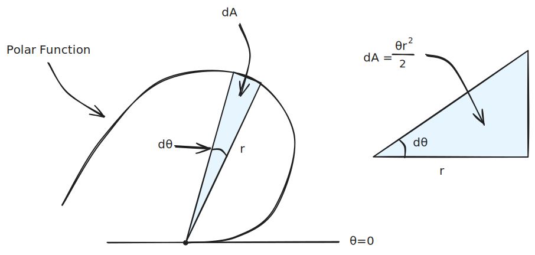
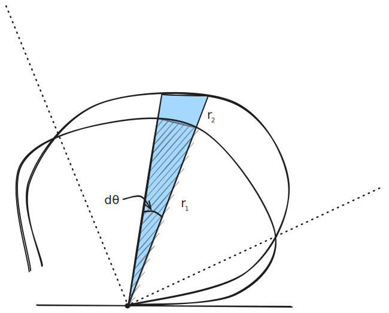

# Polar Calculus

Polar coordinates share the following relationship with $\mathbb R ^2$ cartesian coordinates:

| Cartesian        | Poloar            |
| ---------------- | ----------------- |
| $x$              | $r \ cos(\theta)$ |
| $y$              | $r\ sin(\theta)$  |
| $tan^{-1}(y/x)$  | $\theta$          |
| $\sqrt{x^2+y^2}$ | $r$               |
A polar coordinate *ordered pair* is in the order of $(r, \theta)$. 

### Polar Coordinate Symmetry

1. If $r(\theta) \equiv r(-\theta)$,  there is symmetry with *respect to the polar axis* (i.e. the axis where $\theta = 0$ lays, usually $y=0$).
2. If $r(\theta) \equiv r(\theta + \pi)$, then for all $(r, \theta)$ there is a corresponding $(-r, \theta)$; this is symmetry with *respect to the pole*.
3. If $r(\theta) \equiv r(\pi - \theta)$, then there is symmetry with respect to the $\theta = \pi/2$ axis.

## Polar Integration

%%[🖋 Edit in Excalidraw](../../../media/excalidraw/excalidraw-2025-01-12-22.44.26.excalidraw.md)%%

The differential element for a polar function will be a triangle. The differential area of this triangle is:

$$dA = \frac12 d\theta \ r(\theta)^2$$

If we integrate both sides we get:

$$A=\int \limits_{\theta_0}^{\theta_1} \frac{1}{2}r(\theta)^2\ d\theta$$

#### Area Between Polar Curves

%%[🖋 Edit in Excalidraw](../../../media/excalidraw/excalidraw-2025-01-12-22.53.37.excalidraw.md)%%

If we want to find the area between two polar curves, we have to subtract the smaller area from the larger. Mathematically, this look like:

$$dA = A_2 - A_1 = \frac{1}{2}\big[  r_2^2\ d- r^2_1  \big]\ d\theta$$
$$ A = \frac{1}{2} \int _{\alpha}^{\beta}r_2^2(\theta)- r_1^2(\theta)\ d\theta = A_2 - A_1$$

Note that $\alpha$ and $\beta$ are the angles where the curves first intersect, shown in dotted lines in the diagram above.

