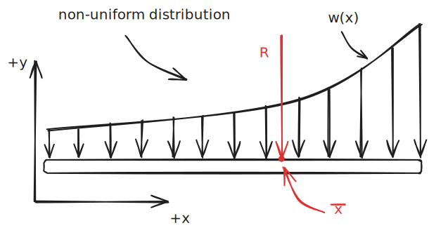
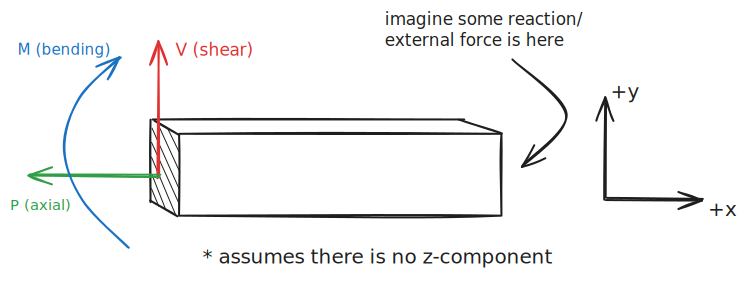
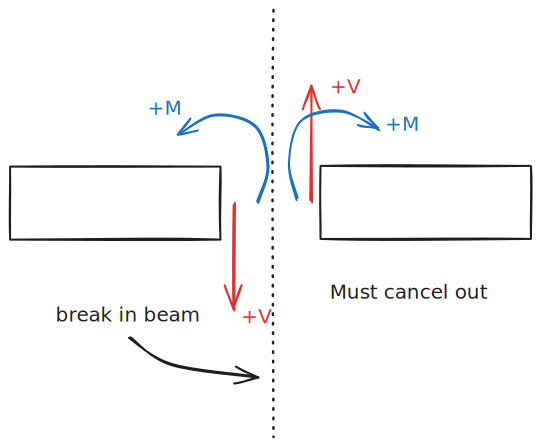
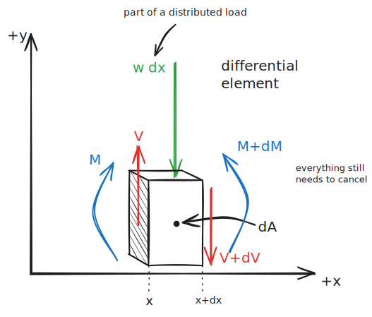

Beams are members that specifically *resist bending*. Their loads are typically applied perpendicular to their longitudinal axis.

Many beam problems will be statically indeterminant, so it's important to look at the number of knowns versus the number of unknowns. 

> In case I forget, statically determinant means $n_{reactions}-n_{equations}=0$ 

## Distributed Loads

You can substitute a distributed load, which may or may not be uniform, with a point load:

%%[🖋 Edit in Excalidraw](../../media/excalidraw/excalidraw-2024-11-12-08.31.38.excalidraw.md)%%

The magnitude of the resultant force is:

$$ R =\int w \ dx  $$

And the $\bar x$ coordinate is:

$$ \bar x = \frac{\int x w\ dx}{R} $$

There are some shortcuts you can take too for primitive shapes:

## Internal Effects

Beams also account for **axial** ($P$), **shear** ($V$), **torsional** ($T$) and **bending** ($M$) forces. These are all *internal forces*, so they must be developed in order to maintain equilibrium with any external force (for statics at least). 

%%[🖋 Edit in Excalidraw](../../media/excalidraw/excalidraw-2024-11-12-08.47.36.excalidraw.md)%%

You can use the basic equations of equilibrium to find these values at any slice of a beam.

%%[🖋 Edit in Excalidraw](../../media/excalidraw/excalidraw-2024-11-12-09.03.56.excalidraw.md)%%

#### Mathematical Relationship
All of these values are related mathematically:

%%[🖋 Edit in Excalidraw](../../media/excalidraw/excalidraw-2024-11-12-08.55.12.excalidraw.md)%%

If we sum forces *in the y-axis*:

$$ \sum F_y = V-(w\ dx)-(V+dV) = 0 $$

You can solve this to get:

$$w = -\frac{dV}{dx} $$

Now, if you were to plot shear over $x$, you would know that its slope must be equal to the loading. This also means that you can integrate to solve for the shear force:

$$\int \limits_{V_0}^V dV=-\int\limits_{x_0}^xw\ dx$$

where $V_0$ is the shear force at $x_0$, which is requisite to evaluate the definite integral.

Next, if we *sum the moments* about a point on the element:

$$\sum M=M+(w\ dx)(\frac{dx}2)+(V+dV)(dx)-(M+dM)=0$$

Simplifying yields:

$$ V = \frac{dM}{dx} $$

If you were to plot the moment over $x$, you would know that its slope would be equal to the shear for each point. And, because $V$ is expressed in terms of the load, we can also say:

$$ \frac{d^2M}{dx^2}=-w$$

Again, you can also integrate to evaluate $M$:

$$ \int \limits _{M_0}^M dM = \int \limits_{x_0}^xV\ dx$$

where $M_0$ is the bending moment at $x_0$.

