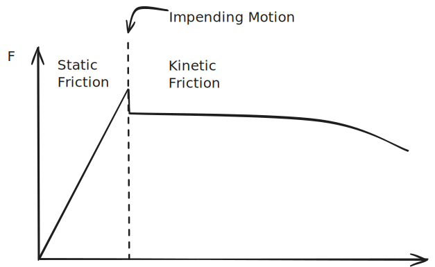

# Friction

Tangential force between two surfaces that results in a loss of energy.

- *Ideal friction* means that the friction is *negligible* 
- *Real friction* is not negligible 

**Dry Friction** occurs when two unlubricated solids slide along each other. This is also sometimes called *Coulomb Friction*.

**Fluid Friction** occurs when adjacent fluid layers moving at different velocities interact. A friction layer is generated at the boundary between the two streams. This is explored more in fluid dynamics.

**Internal Friction** occurs in all solids. This is caused from the hysteresis loop in the elastic region of materials, which will end up absorbing elastic energy.

%%[🖋 Edit in Excalidraw](../../media/excalidraw/excalidraw-2024-11-19-09.01.29.excalidraw.md)%%

$$F_{max} = \mu _sN \tag{Static Frction}$$

$$F_k = \mu _kN \tag{Kinetic Frction}$$

These are approximations of a more complicated interaction.

### Shortcuts
