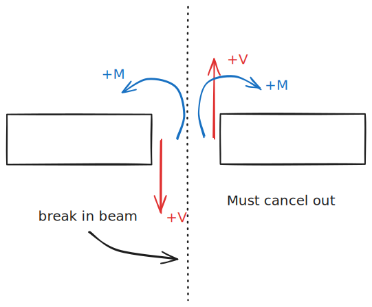

# 3. Beams

Much of this chapter is also included in [Beams](Beams.md).

---

A **Cantilevered Beam** beam has one end fixed and one free.

A **Simply-Supported Beam** has a pinned end and a rolling end:

![[image-48.png]]

Simply supported beams are statically indeterminant due to the extra restraint. 

--- 

From the [Beams](Beams.md) chapter, the highlights are:

- $\omega$ is the distributed force over the beam
- $V$ is the shear force.
- $M$ is the bending moment
- ^ All three are functions of $x$
- The sign convention is:
	

- $w = -\frac{dV}{dx}$
- $\int \limits_{V_0}^V dV=-\int\limits_{x_0}^xw\ dx$
- $V = \frac{dM}{dx}$
- $\frac{d^2M}{dx^2}=-w$
- $\int \limits _{M_0}^M dM = \int \limits_{x_0}^xV\ dx$
- When you can't integrate $V$, you may treat $\omega$ as an impulse function $\delta$. [^1] 

> **Discrete Loads**
> For instance,
> 
> 
> The corresponding shear-moment diagram is:
> 
> 
> 
> Notice that, as we cross the point load, the shear drops by exactly $4\ kN$, which is exactly the magnitude of that point load.
        

[^1]: https://en.wikipedia.org/wiki/Dirac_delta_function

## Stresses in Beams

The bending moment is actually just normal stress. Similar to how [Torsion](2.%20Torsion%20Bar.md) is a linear function of radius, the bending moment is a *linear* function of normal stress from the **Neutral Surface**. 

![[image-49.png]]

The neutral surface can be calculated by enforcing that $\iint dF =0$. For symmetric cross sections, the neutral axis is in the center. 

--- 

%%[🖋 Edit in Excalidraw](excalidraw-2025-09-15-19.51.30.excalidraw.md)%%

The shaded region shows part of the cross section. In this, the stress is constant as $\Delta y \approx 0$ and $d \sigma / dx = 0$ . Notice that stress is linearly increasing, such that $\sigma (y)= c y$  where $c$ is a constant. 

The force and moment from this section can be described as:

$$dF = \sigma \, dA, \qquad dM = \sigma y \,dA$$

Integrating the moment equation gives us:

$$M = \iint \sigma y \, dA = \iint cy^2 dA = cI_y$$

where $I_y$ is the area moment of inertia in the y axis. 

Solving for $c$ shows: $c = M/I_y$

Rearranging things will allow us to find the stress at a given spot $y$:

$$\sigma (y) = -\frac{My}{I}$$

Some quick notes, since I don't have them elsewhere:

Area moment of inertia (second moment of area) in the $n$ axis is:

$$I_n = \iint _A n \,dA$$

The parallel axis theorem is:

$$I_{n'} = I_n + Ad^2 \quad \text{if}\quad n' =n+d$$

