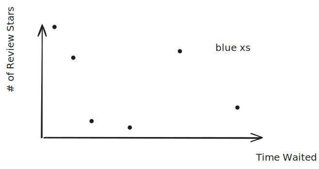

# Exam 3 Practice Test

## Problem 1

Iterate through all the lines in the file.
```txt

	lastWord = TimeWaited, 
	rest = " 59min 1 star Review"
	
		times = [59]
		lastWord = '59min'
		word = '1'
		rest = 'star Review'
		
		lastWord = '1'
		word = 'star'
		rest = 'Review'
		
		reviews = [1]
		lastWord = 'star'
		word = 'Review'
		rest = ''

	lastWord = '2'
	word = 'star'
	rest = ' Review Time_Waited: 97min Reason: kitchen'
	
		reviews = [1 2]
		lastWord = 'star'
		word = 'Review'
		rest = 'Time_Waited: 97min Reason: kitchen'


...

times = [59, 97, 20, 10, 30, 40]
reviews = [1, 2, 4, 5, 1, 5]

	
```


1. 
%%[🖋 Edit in Excalidraw](../../media/excalidraw/excalidraw-2024-11-16-19.00.01.excalidraw.md)%%

2. `-1`
3. Nothing, these are redundant
4. Yes, the `\n` wouldn't be removed and instances like `10min`, which get changed into `10min\n` will not be able to be cast into doubles by simply removing the last three indices. 

## Problem 2

```

function out = remakeImage(filename)

	% resize to 500x1000
	img = imread(filename)
	img = imresize(img, [500, 1000])

	% replace the top left quadrant with the transposed right half
	right_transpose = img(:, end/2+1:end, :)'
	right_transpose = imresize(right_transpose, [250, 500])

	% replace magenta with white
	magenta_mask = (right_transpose(:,:,1) == 255) & ...
					(right_transpose(:,:,2) == 255)
	right_transpose(magenta_mask, 3) = uint8(255)

	img(1:end/2, 1:end/2, :) = right_transpose % this might not work

	% remove the right half of the image
	img = img(:,1:end/2,:)

	% swap bottom left quadrant 90 degrees and swap red and green layers
	right_corner = img(end/2+1:end, end/2+1:end, :)
	right_corner = imrotate(right_corner, -90)

	
	
	


end


```
> 🤖 (notecheck comment) - The code checks for R=255 and G=255 (which is yellow), not magenta. Magenta is typically R=255, G=0, B=255. Make sure your mask checks for the correct channel values for magenta.