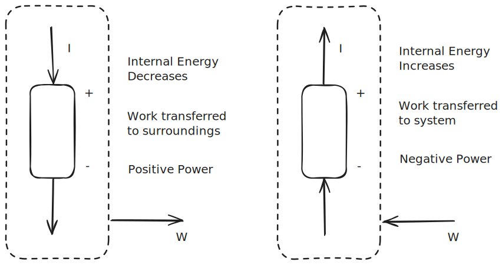

# 1.1. Circuit Basics

## 1.1.1 Current & Charge

Current is the amount of charge that passes through an **area** per unit time:

$$i=\frac{dq}{dt}$$

We draw current **positive** if it flows positive to negative; we draw it **negative** if it flows negative to positive.

## 1.1.2 Voltage

A particle moving through an electric field will either gain or lose potential energy. This potential energy, per unit charge, is voltage.

$$∆V = -\int _c \textbf E\cdot d \vec l= - \frac{dw}{dq}$$
where:
- $\int_c E\ ds$ is the line integral in an electric field across some path
- ${dw}/{dq}$ is the change in potential energy per unit charge

The unit will be in *energy per charge*, which is usually $J/C$. 

#### Example

If 4C of charge loses 20J of energy across points $a\to b$, what is the voltage?

$$\frac{dw}{dq}=\frac{20 J}{4C}=5V$$

A positive voltage means the particle will lose energy; a negative voltage means it would gain energy. 

#### Relativity

Voltages are always measured relative to another voltage. This is why we say $∆V$.

Voltages also sum when in series.

## 1.1.3 Power and Energy

Power, generically, is $\dot W$, i.e. the time derivative of energy/work. In circuits, power is:

$$\dot W = IV$$

As for the **sign** of power:

%%[🖋 Edit in Excalidraw](../../media/excalidraw/excalidraw-2025-01-07-10.06.30.excalidraw.md)%%

In this class, we *assume no energy crosses the system boundary*, so we can say:

$$\sum _i \dot W _i = 0 $$
We can use this property (under the assumption) to find unknown power in the system.

## 1.1.4 Resistance and Ohm's Law

Resistivity ($\rho$) is a material property. Resistance ($R$) can be calculated from resistivity with:

$$R = \frac{\rho L}{A}$$

where $L$ is the length of the conductor and $A$ is the cross-sectional area.

Conductance (G) is the reciprocal of resistance (R).
Conductivity ($\sigma$) is the reciprocal of resistivity ($\rho$).

When charged particles pass through a resistive material, they lose energy. This loss of energy can be expressed on a per-charge basis, i.e. a voltage basis. **Ohm's law** describes this voltage produced by a resistive material:

$$V=IR$$
> For signs:
> - If current flows positive to negative, $v=iR$
> - If current flows negative to positive, $v=-iR$
> I think this is just an artifact of the goofy labeling they have in this class.

## 1.1.5 Circuit Diagrams

Independent Voltage Source

Independent Current Source

**Junctions** are places on the diagram where wires connect.

**Nodes** may contain multiple junctions. Nodes are where *circuit elements connect*. Notice that the nodes, shown below, might not be obvious at first, but if you imagine what would happen if you shrank all of the wires, each node would converge into a single point.

