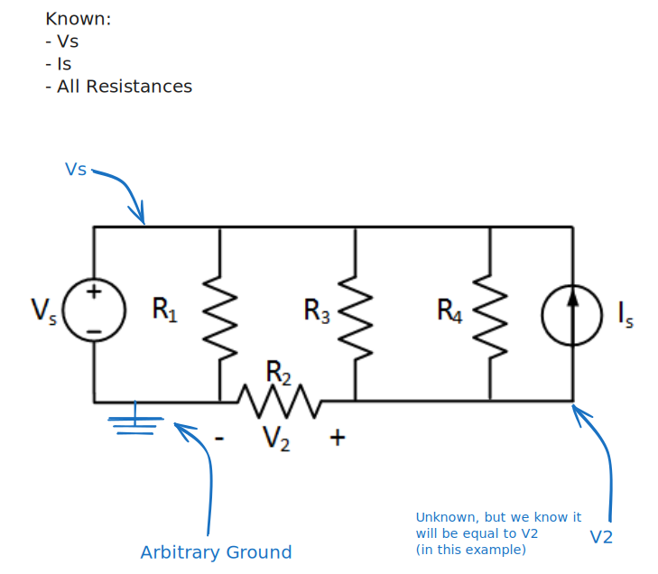
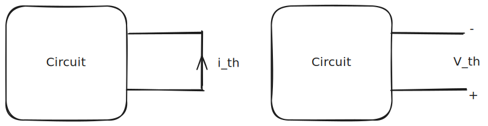
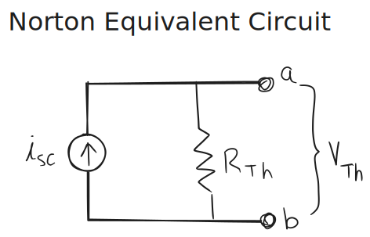

# 1.2. Resistive Circuits

## 1.2.1 Kirchhoff's Voltage Law (KVL)

Kirchhoff's voltage law states that **the sum of voltages around any loop is zero.**

If voltage is gravitational potential energy, walking around any terrain in a loop means that the sum of changes in height is also zero.

Remember, the voltage over a current source is nonzero. Even if it is not given, it must be accounted for.

## 1.2.2 Kirchhoff's Current Law (KCL)

Kirchhoff's current law states that **the sum of currents entering a node equals the sum of currents leaving that node.**

$$\sum _i I = \sum _e I$$

You could expand this in a few ways:
1. If you flip the signs of current such that all "arrows" lead *into* the node, you can say that *the sum of all currents entering the node is zero*.
2. If you flip the signs of current such that all "arrows" lead *out of* the node, you can say that *the sum of all currents exiting the node is zero.*

> I like the first version. Think of all arrows that point into the node.

## 1.2.3 Series & Parallel Resistors

**Resistors in Series** simply sum:

$$R_{eq} = \sum_i R_i \tag{Series}$$

**Resistors in Parallel** do this inverse thing:

$$R_{eq} = \bigg[\sum _i \frac{1}{R_i}   \bigg]^{-1} \tag{Parallel}$$

## 1.2.4 Equivalent Resistance

**Equivalent Resistance** is the total resistance of a combination of resistors that, if replaced by a single resistor of equivalent resistance, would yield the same circuit.

## 1.2.5 Voltage Divider Law

The voltage divider law is:

$$V_{out} = \frac{R_2}{R_1+R_2}V_{in}$$

This is derived from KVL and Ohm's law. First, you find the current from the ESR, then use Ohm's law to find the voltage drop over the first one. 

> Try reducing the number of resistors before applying this voltage law.

## 1.2.6 Current Divider Law

$$I_{out} = \frac{R_1}{R_1+R_2}I_{in}$$

You can derive this by replacing the resistors with a single equivalent resistor. From this, you can find the voltage drop across the equivalent resistor. Because the resistors are in parallel, the voltage drop will be equal. Finally, plug this voltage drop into Ohm's law and you get the equation above.

## 1.2.9 Mesh Analysis

A systematic way to solve resistive circuits.

1. Identify each non-inclusive loop.
2. Set an arbitrary current for each loop and solve KVL.
3. Solve for the arbitrary currents.

In a situation like this, the voltage across $R_2$ depends on both $I_1$ and $I_2$. The way we would express this is $R_2(I_1 - I_3)$. We would need to do something similar for $R_2$. When you do this, you end up with a system of equations to solve.

> 🤖 (notecheck comment) - There is an inconsistency referencing I_2 and I_3. The text first says the voltage depends on I_1 and I_2, but then uses I_1 - I_3 in the expression. Possibly the expression should be R₂(I₁ - I₂), or the earlier mention of I₂ should be replaced by I₃.

## 1.2.10 Node Analysis

Another systematic application of KCL

4. Select a ground node.
5. Define arbitrary node voltages.
6. Do a KCL at nodes with unknown voltages.
7. Solve for node voltages.

Set an arbitrary node to 0V. Then, using Ohm's law, find all the voltages possible. For the remaining nodes that have unknown voltages, assign arbitrary values.

Just by applying KCL at the nodes with the unknown voltages, you can get equations that constrain the values of $v_a$ and $v_b$. 

#### Node Analysis Example

%%[🖋 Edit in Excalidraw](../../media/excalidraw/excalidraw-2025-01-14-13.28.16.excalidraw.md)%%

Assume the following values:

| Variable | Value  |
| -------- | ------ |
| $V_s$    | $8V$   |
| $I_s$    | $10mA$ |
| $R_1$    | $100Ω$ |
| $R_2$    | $200Ω$ |
| $R_3$    | $300Ω$ |
| $R_4$    | $600Ω$ |

Let's look at the node that has the voltage $V_2$, we get the equation:

$$0=-10mA + \frac{8V-V_2}{600Ω}+\frac{8V-V_2}{300Ω}-\frac{V_2}{200Ω}$$

The terms with a voltage over resistance are from Ohm's law; the numerator is the voltage difference. 

Solving this equation gives $V_2 = 3V$. 

## 1.2.11 Thevenin Equivalent Circuits

You can replace an arbitrary resistive circuit component with an arbitrary circuit using a voltage source and a resistor:

- $R_{Th}$ is the equivalent resistance through the circuit.
- $V_{Th}$ is the voltage across the circuit.
- $i_{sc}$ is the current under a short.

%%[🖋 Edit in Excalidraw](../../media/excalidraw/excalidraw-2025-01-14-13.40.57.excalidraw.md)%%

> When trying to find the *equivalent resistance*, you should short out the voltage sources and open-circuit the current sources; then you can find the equivalent resistance. No clue why this works.

You can replace this circuit with:

Once you know your Thevenin circuit, you can use the following equation to maximize power to the circuit by choosing the resistor $R_L$ that sits between $a$ and $b$:

$$P_L = \bigg(\frac{R_L}{R_{Th}+R_L}V_{Th}\bigg)^2\frac{1}{R_L}$$

## 1.2.12 Norton Equivalent Circuits

%%[🖋 Edit in Excalidraw](../../media/excalidraw/excalidraw-2025-01-27-13.59.55.excalidraw.md)%%

$$V_{Th}=R_{Th}i_{sc}$$

- $i_{sc}$ is still the short-circuit current. This can be found using Ohm's law (or by shorting it).

You can interchange between [Thevenin Equivalent Circuits](1.2.%20Resistive%20Circuits.md#2.11%20Thevenin%20Equivalent%20Circuits) and these Norton equivalent circuits.

This circuit will deliver maximum power when its load is equal to $R_{Th}$. 

## 1.2.13 Linearity and Superposition

Because the voltage drop across a resistor is a linear function of current, you can say that:
- A change in voltage results in a proportional change in current.
- An increase/decrease in source voltage results in proportionally large/small voltage drops.

Superposition relies on the same principle; it allows you to say stuff like:

Now, if you have a circuit with multiple sources (either current or voltage), you can:
1. Zero out all sources except one.
2. Solve for the voltage/current of interest.
3. Select another source and repeat step 1 until all sources are included.
4. You should have a list of different values for the voltage/current of interest. You can simply sum these values to get the value for the complete circuit.

