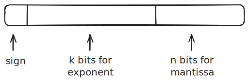

# Floating Point Math

## Representation

A floating point number is represented in three parts.

%%[🖋 Edit in Excalidraw](../../media/excalidraw/excalidraw-2025-01-27-17.21.26.excalidraw.md)%%

To interpret this number, we apply:

$$N=M\cdot \beta ^E$$

where:
- $M$ is the mantissa 
- $\beta$ is the base
- $E$ is the exponent

We calculate the exponent using:

$$E=e-\text{bias}$$

where $e$ is the smallest or largest integer possible with $k$ bits of memory. However, we need to reduce the range by $1$ on either side (i.e., $2$ total) to ensure that we don't have a long sequence of all zeros or all ones. For instance, if $k=4$, the maximum and minimum values are $15$ and $0$, respectively; however, we reduce the range to $1 \le e \le 14$ to ensure that $e$ is never represented by all ones or all zeros.

The $\text{bias}$ is calculated using:

$$ \text{bias} = \beta ^{\;k-1}-1 $$
where $\beta$ is the base and $k$ is the number of bits in the exponent.

> We do this to make the range work with small numbers too.

So, if $1 \le e \le 14$, and the bias is $7$, then $-6 \le E \le 7$.