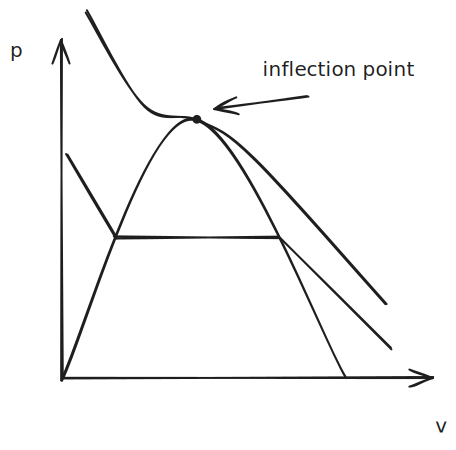

# 10. Thermodynamic Relations

## Ideal Gas Law

The **virial equation of state**, which is derived from statistical mechanics, allows us to relate pressure, volume, and temperature. One form of this equation of state is the compressibility factor $Z$ approximated as an n-degree polynomial:

$$Z \approx 1+\frac{B(T)}{\bar v}+\frac{C(T)}{\bar v^2}+\frac{D(T)}{\bar v^3}+\cdots $$

As discussed, when $Z \rightarrow 1$ , we get the ideal gas law.

$$ Z = \frac{p \bar v}{\bar R T} \Rightarrow p \bar v = \bar R T \tag{Ideal Gas}$$

However, when $Z \not \approx 1$, the ideal gas law does not work. There are *hundreds of equations* which try to describe the relationship in these conditions better while avoiding the long n-degree polynomial, but these equations are all only applicable over a *specific property region* (i.e., a range of temperatures, pressures, etc.).

## Two-Constant Equations of State

Two different equations of state, which attempt to consider some of the gas's non-ideal compressibility are the **van der walls** and **Redlich-Kwong** equations of state. These equations use *two constants* to approximate a non-one compressibility. 

### Van der Waals Equation

In 1873, van der Waals proposed a new equation to predict gas behavior that considered the fact that gas molecules occupy a significant part of the gas's volume. The negligence of this is a key component to the ideal gas law. His equation of state was:

$$ p = \frac{\bar R T}{\bar v - b} - \frac{a}{\bar v ^2} $$

where:
- $b$ accounts for the volume occupied by the molecules themselves
- $a$ accounts for the interactions between the molecules. 

#### Evaluating $a$ and $b$ 

On the p-v diagram, if we trace an isotherm that passes through the critical point, we will notice that there exists an inflection point, where the first and second order derivatives are simultaneously zero.

$${\left( {\frac{{{\partial ^2}p}}{{\partial {{\bar v}^2}}}} \right)_T} = 0,{\rm{\;\;}}{\left( {\frac{{\partial p}}{{\partial \bar v}}} \right)_T} = 0{\rm{\;\;}} \tag{1}$$

%%[🖋 Edit in Excalidraw](../../media/excalidraw/excalidraw-2024-11-14-14.43.00.excalidraw.md)%%

With this relationship, we can express the van der Waals equation using critical properties. This *does decrease the accuracy of the equation*, but who cares ig.

The derivation to solve for $a$ and $b$ is as follows:

$${p_{\rm{c}}} = \frac{{\bar R{T_{\rm{c}}}}}{{{{\bar v}_{\rm{c}}} - b}} - \frac{a}{{\bar v_{\rm{c}}^2}}$$

If we substitute the values in equation (1) into the first and second order partial derivatives of this equation, we can obtain two equations that we can use to solve for $a$ and $b$. 

First, substituting the first order derivative gives us:

$${\left( {\frac{{\partial p}}{{\partial \bar v}}} \right)_T} =  - \frac{{\bar R{T_{\rm{c}}}}}{{{{\left( {{{\bar v}_{\rm{c}}} - b} \right)}^2}}} + \frac{{2a}}{{\bar v_{\rm{c}}^3}} = 0$$

Then, substituting the second order derivative yields:

$${\left( {\frac{{{\partial ^2}p}}{{\partial {{\bar v}^2}}}} \right)_T} = \frac{{2\bar R{T_{\rm{c}}}}}{{{{\left( {{{\bar v}_{\rm{c}}} - b} \right)}^3}}} - \frac{{6a}}{{\bar v_{\rm{c}}^4}} = 0$$ 
Now we can develop the following expressions for a and b:

$$a = \frac{26}{64} \frac{\bar R^2 T_c^2}{p_c},\ b=\frac{\bar RT_c}{8p_c}$$

We can also make the connection that:

$$\bar v_c = \frac{3}{8} \frac{\bar R T_c}{p_c}$$ 

Values for $a$ and $b$ *can be found in table A-24* for select substances. This can help save some time.

#### Generalized Form of the Van der Waals EoS

If you bring the compressibility factor into the Van der Waals equation of state, along with the reduced temperature ($T_R = T/T_C$) and pseudo-reduced specific volume ($v'_R =p_cv/\bar R T_c$ ), you can state the following:

$$ Z = \frac{v_R'}{v'_R-1/8}-\frac{27/64}{T_Rv'_R}$$

### Redlich-Kwong equation
 
The Redlich-Kwong equation is generally considered the *better of the two equations*. It was proposed in 1949 and it was created mainly to describe macroscopic effects without rigorous molecular justification.

$$p = \frac{\bar RT}{\bar v - b} - \frac{a}{\bar v(\bar v+b)T^{1/2}} $$

The values of $a$ and $b$ can be found with:

$$ a = a'\frac{{{{\bar R}^2}T_{\rm{c}}^{5/2}}}{{{p_{\rm{c}}}}}{\rm{\;\;\;and\;\;\;}}b = b'\frac{{\bar R{T_{\rm{c}}}}}{{{p_{\rm{c}}}}} $$

where:
- $a'=0.42748$
- $b'=0.08664$ 

Again, *these values are tabulated in table A-24* for some common substances.

#### Generalized Form

Again, like we did for the van der waals radius, you can introduce the compressibility factor to get a generalized form of this equation:

$$Z=\frac{v_R'}{v_R'-b'}-\frac{a'}{(v'_R+b')T_R^{3/2}} $$

## Multi-constant Equations of State

There are a few other equations that can be used to better describe real gas behavior. Without the limitations of two constants, accuracy can be much higher.

The **Beattie-Bridgeman equation** can be expressed in its *turncated* virial form as:

$$p =\frac{\bar R T}{\bar v}+\frac{\beta}{\bar v^2}+\frac{\gamma}{\bar v^3}+\frac{\delta}{\bar v^4}$$

where:
- $\beta = B\bar R T - A - c\bar R /T^2$
- $\gamma = -Bb\bar R T + Aa - Bc \bar R/T^2$
- $\delta = Bbc\bar R /T^2$ 
- $a, b, c, A,$ and $B$ are determined experimentally by curve fitting.

The **Benedict-Webb-Rebuin Equation** is:

$$p = \frac{\bar R T}{\bar v}+(B \bar R T - A - \frac C{T^2})+\frac{1}{\bar v^2}+\frac{(b \bar R T -a)}{\bar v ^3}+\frac{a \alpha}{\bar v ^6} + \frac{c}{\bar v ^3 T^2}(1+\frac{\gamma}{\bar v ^2})e^{-\frac{\gamma}{\bar v ^2}}$$

Constants for this equation for some select substances are listed in table A-24.

