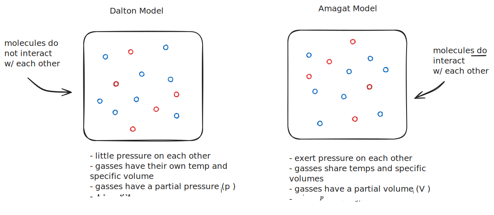
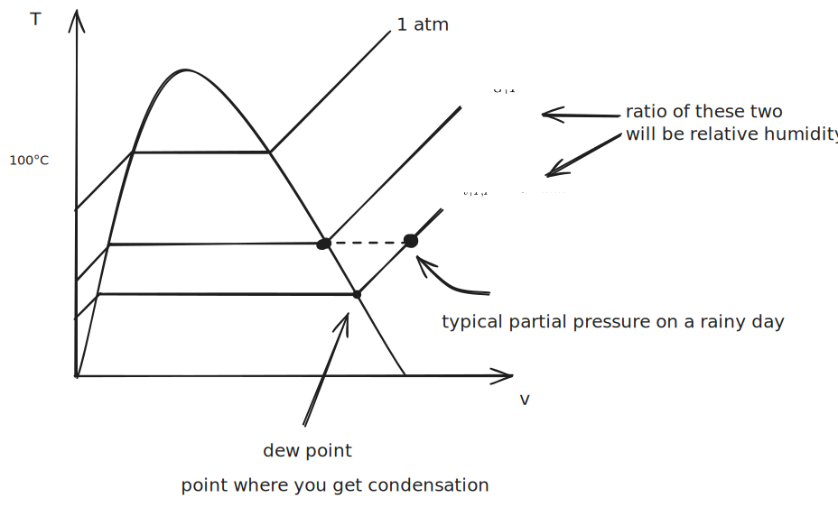
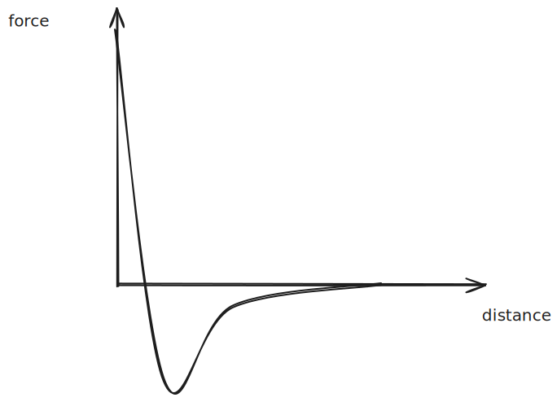
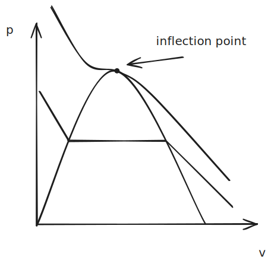

# 11. Air-Water Mixtures

November 14, 2024

---

## Exam Remarks

- 4 Questions
- We are expected to know which cycles are which

## Mixture Fractions

We want to find the number of moles for a substance with:

$$ n_i = \frac{m_i}{M_i}$$ 

You can define a **mass fraction** as the mass of a particular species divided by the total mass:

$$ (mf) = \frac{m_i}{\sum m}$$ 

> He calls $(mf)$ just $f_i$ to avoid having two letters for a single number. $(mf)$ is what the book uses; there is no physical difference.

$$ \sum _if_i = 1 $$ 

Similarly, you can define a **mole fraction** as:

$$ y_i = \frac{n_i}{\sum n},\ \sum_iy_i = 1 $$

With these fractions, you can calculate the molar mass of a gas composed of many other gases:

$$ M = \sum _i y_i M_i $$

This is where $28.97$ comes from for the molar mass of air.

You can extend this logic to get different values:

- Molar specific internal energy is $\bar u = \sum_i y_i \bar u_i$ 
- Molar specific enthalpy is $\bar h = \sum_i y_i \bar h_i$ 
- Molar specific entropy is $\bar h = \sum_i y_i \bar h_i$ 
> 🤖 (notecheck comment) - The formula for molar specific entropy is incorrectly written as “h”; it should be “s”. The correct equation is: 
>       (molar specific entropy) = (bar s) = Σi y_i (bar s_i).

- Molar specific heats are $\bar c_v = \sum_i y_i \bar c_{vi}$ and $\bar c_p = \sum_i y_i \bar c_{pi}$

When we mention air, we often *neglect the water vapor* in the air because it is variable and can largely influence the properties. For consistency, we usually only consider *dry air*.

### Gas Models

There are two different models for how gases interact:

%%[🖋 Edit in Excalidraw](../../media/excalidraw/excalidraw-2024-11-14-14.16.11.excalidraw.md)%%

Depending on the mixture, one model will better represent the behavior.

### Humidity 

**Relative humidity** ($\phi$) is the number of moles of water vapor relative to the number of moles of water vapor at a saturated point, assuming constant pressure and temperature.

$$ \phi = \frac{y_v}{y_{v, sat}} = \frac{P_V |_{T,p}}{P_G|_{T}} $$

%%[🖋 Edit in Excalidraw](../../media/excalidraw/excalidraw-2024-11-14-14.29.10.excalidraw.md)%%

It’s possible to have a relative humidity slightly higher than 1; this happens when the Dalton model breaks down. Here, the ideal gas law also breaks down.

However, in engineering, it’s often more convenient to consider the **Humidity Ratio**:

$$ \omega =  \frac{M_v}{M_a} = \frac{M_{H_2O} P_v}{M_a(P-P_v)} $$

where:
- $M_v$ is the molecular weight of water vapor
- $M_{H_2O}$ is the molecular weight of water
- $M_a$ is the molecular weight of air
- $P_v$ is the partial pressure of water vapor
- $P$ is the total pressure

### New Equation of State

When we get close to condensation, the ideal gas model falls apart. We can use these new equations when the ideal gas model doesn’t work.

**Van der Waals forces** cause the molecules to attract each other, but if you push hard enough, they end up repelling each other. You end up getting this force curve:

%%[🖋 Edit in Excalidraw](../../media/excalidraw/excalidraw-2024-11-14-14.40.17.excalidraw.md)%%

To account for this, we use values $a$ and $b$:
- $a$ represents how the pressure shrinks due to repulsive forces
- $b$ represents how the specific volume shrinks due to attractive forces

> 🤖 (notecheck comment) - The roles of "a" and "b" are reversed. In the Van der Waals equation, "a" represents the effect of intermolecular attraction (reducing the pressure), while "b" represents the excluded volume (repulsive effect).

Van der Waals Equation of State

$$ p = \frac{\bar R T}{\bar v - b} - \frac{a}{\bar v ^2} $$

Redlich-Kwong Equation of State

$$P = \frac{\bar R T}{\bar v - b} - \frac{a}{\bar v (\bar v + b)T^{\frac 12}}$$

Virial Equation of State:

$$ \frac{p \bar v}{\bar R T} = Z = 1 + \frac{B(T)}{\bar v} + \frac{C(T)}{\bar v^2}  + \frac{D(T)}{\bar v^3}$$

*You can solve for values $a$ and $b$ by looking at the inflection point on the isotherm that passes through the critical point:*

%%[🖋 Edit in Excalidraw](../../media/excalidraw/excalidraw-2024-11-14-14.43.00.excalidraw.md)%%

Mathematically, the inflection looks like:

$$(\frac{\partial ^2P_c}{\partial \bar v^2})_{T_C} = 0,\ {\frac{\partial  P_c}{\partial \bar v}} = 0$$

Using this, you can then derive $a$ and $b$.

$$(\frac{\partial ^2 P_c}{\partial \bar v^2})_{T_C} = \frac{2 \bar R T_C}{(\bar v_c-b)^3} - \frac{6a}{\bar v_c^4} = 0 $$

$$ (\frac{\partial P_c}{\partial \bar v})_{T_C} = - \frac{\bar R T_C}{(\bar v - b)^2} + \frac{2a}{\bar v^3} = 0$$

$$ a = \frac{27}{64} \cdot \frac{\bar R^2 T_C^2}{P_C}, \ b = \frac{\bar R T_C}{8 P_C}$$

## Psychrometrics

Relationships between water vapor in the air.

Relative Humidity Ratio:
$$ \omega = \frac{m_V}{m_a} = \frac{m_V P_V \frac{V}{\bar R T}}{M_a P_a \frac{V}{\bar R T}} = \frac{M_V}{M_a}\cdot \frac{P_V}{P_a} = 0.622 \frac{P_V}{P-P_V}$$

Relative Humidity:

$$ \phi = \frac{y_v}{y_{v, sat}}|_{T,P} = \frac{P_V |_{T,P}}{P_G|_{T}}$$

> There will be one of these problems on the final.