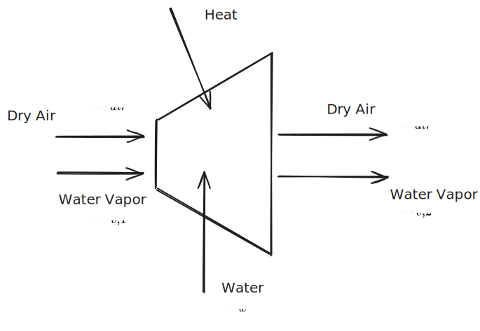

# 11. Psychrometrics

--- 

# Ideal Gas Systems

If a gas composed of sub-gasses behaves like an ideal gas, and each constituent gas also behaves ideally, we can make some assumptions.

We can say that the *mass fraction* of a constituent gas relative to the mass of all the gas is:

$$ m_{f} = \frac{m_i}{m} \tag{Mass Fraction}$$

If done correctly, all mass fractions should add up to one ($1 = \sum_i m_{f,i}$). You can apply the same logic to derive a *mole fraction*, which is:

$$y_i = \frac{n_i}n \tag{Mole Fraction}$$

Again, the sum of all mole fractions will be $1$.

The *apparent molecular mass* (i.e., the average molecular weight of the compound gas) can be found by taking the weighted average of all the molar masses of the constituent gasses by their mole fraction:

$$M =\sum _i = y_iM_i$$

### Modeling Ideal Gasses

There are popular two ways we can think about ideal gasses. One is the **Dalton model**, which assumes molecules *do not interact* with each other. The other is the **Amagat model**, which assumes that gas molecules *do interact* with each other.

%%[🖋 Edit in Excalidraw](../../media/excalidraw/excalidraw-2024-11-14-14.16.11.excalidraw.md)%%

#### Dalton Model

Because this model *assumes that the interaction between molecules are negligible*, we can say the gasses "overlap" without touching each other. Thus, we can imagine how two gasses occupying the same chamber will both exert a pressure on the walls of the chamber. This total pressure could then be represented as a sum of *partial pressures* of the constituent gasses. 

The partial pressure of a gas, given the number of moles it occupies, is:

$$p_i = \frac{n_i\bar R T}{V} \tag{Partial Pressure}$$

This partial pressure can be expressed as a fraction of the total pressure using the mole ratio $y_i$:

$$p_i = y_ip, \text{\;\;\;such that\;\;\;\;}\sum_ip_i = p$$

Notice that, *if the mole fraction remains constant* through the system, we can say

$$ \frac{p_{i,1}}{p_{i,2}} = \frac{p_1}{p_2}$$

#### Amagat Model 

The Amagat Model makes a different assumption than the dalton model. Instead of assuming that all particles are at the same volume and temperature, *it assumes all particles are at the same pressure and temperature*—constituent gasses are not assumed to occupy the entire model. An artifact of this is that the amagat model operates with *partial volumes instead of partial pressures*.

## Evaluating U, H, S, and specific heats

You can represent the internal energy and enthalpy of a gas from its constituent gasses using the mole fractions:

$$\bar u = \sum _i y_i\bar u_i \text{\;\; and\;\;\;} \bar h = \sum_i y_i \bar h$$

This also carries over to specific heats:

$$\bar c_v = \sum_i y_i \bar c_{v,i} \text{\;\;\;and\;\;\;}\bar c_p = \sum_i y_i \bar c_{p,i}$$

> Remember that:
> $$\bar c_v = \bar c_p + \bar R \tag{ideal gas}$$

And yet again, you can follow this logic for entropy:

$$ \bar s = \sum _i y_i \bar s_i$$

Each of these quantities are the *mole average* of the compound gas. 

> If $\Delta \bar s = 0$, it does not necessarily mean that $\Delta \bar s_i = 0$ for all constituent gasses; individual substances may increase in entropy and others may decrease. 

> When mixing two gasses, entropy is generated. Fundamentally, you are increasing the disorder by mixing two initially separated gases, but you can also quantify this using a second-law analysis.

## Psychrometric Principles

# Lecture Notes

> One of the problems on the final will be about this

Psychrometry is the study of moist error. This has applications in weather and with air conditioning. 

As discussed with humidity, the **humidity ratio** is:

$$ \omega = \frac{m_v}{m_a}$$ 
This is the fraction of the mass of water vapor in the mass of air.

You can express this with the ideal gas law:

$$ \omega = \frac{m_v}{m_a} =\frac{M_vP_v \frac{V}{\bar R T}}{M_a P_a \frac{V}{\bar R T}}= \frac{M_v P_v}{M_aP_a} \approx 0.622 \frac{P_v}{P-P_V}$$

where:
- $P_A$ and $P_V$ are the partial pressures of air and vapor respectivey, where $P_A=P-P_V$ 
- $M_V$ and $M_a$ are the molecular weights of water vapor and air

You can also express **relative humidity** as:

$$ \phi = \frac{P_V|_{T,P}}{P_g|_T}$$

where
- $P_g$ is the dew point

%%[🖋 Edit in Excalidraw](../../media/excalidraw/excalidraw-2024-11-21-14.12.44.excalidraw.md)%%

## Conditioning Air

%%[🖋 Edit in Excalidraw](../../media/excalidraw/excalidraw-2024-11-21-14.14.21.excalidraw.md)%%

Using an mass balance, you can say:

$$\dot m_{air, 1} = \dot m_{air, 2}$$ 
$$\dot m_{v, 1} + \dot m_{w} = \dot m_{v, 2} $$

$$ \omega_1 = \frac{\dot m_{v,1}}{\dot m_{a, 1}}, \ \omega_1 = \frac{\dot m_{v,2}}{\dot m_{a, 2}}$$

$$ \dot m_w = \dot m_a (\omega_2 - \omega _1) $$

Then, using a control volume energy balance:

$$\cancel {\frac{dE}{dt}} = 0 = \dot Q_{cv} - \cancel{\dot W_{cv}}+\sum _im_ih_i - \sum _e m_e h_e$$

$$ 0 = \dot Q_{cv} + \dot m_a h_{a,1}+\dot m_{v,1}+\dot m_w h_w - \dot m_ah_{a,2}, - \dot m_{v,2}h_{v,2}$$

Then, by substituting the mass relationships shown above, and *assuming that the water vapor's enthalpy is approximately that of a saturated vapor*, we can write this as: 

$$ 0 =\dot Q_{cv} + \dot m_a [(h_{a,1}-h_{a,2})+\omega_1h_{g,1} + (\omega_2 - \omega _1)h_w-\omega_2 h_{g,2}]$$

## Psychrometric Charts

The *enthalpy of moist air* is:

$$h = (h_a+\omega h_v)_1$$

When heating air, the humidity ratio does not necessarily change. If no water or air is added/removed, it will remain constant. So, if you are heating moist air, you can trace between temperatures along a horizontal humidity ratio line.

