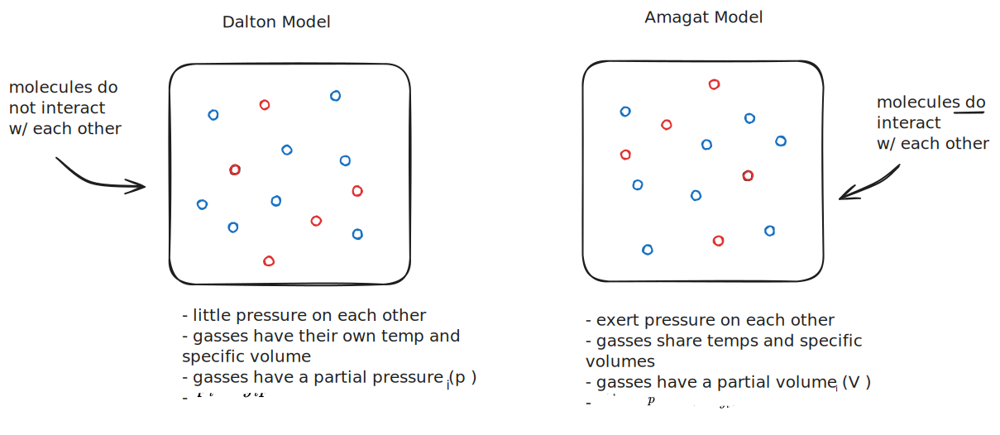
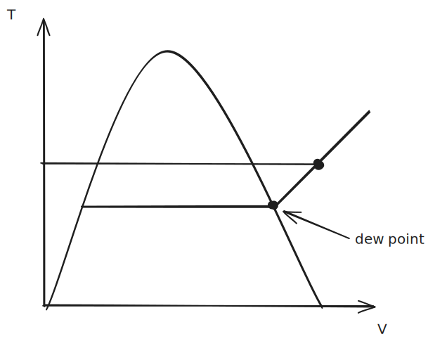

# 11. Psychrometrics

--- 

# Ideal Gas Systems

If a gas composed of sub-gases behaves like an ideal gas, and each constituent gas also behaves ideally, we can make some assumptions.

We can say that the *mass fraction* of a constituent gas relative to the mass of all the gas is:

$$ m_{f} = \frac{m_i}{m} \tag{Mass Fraction}$$

If done correctly, all mass fractions should add up to one ($1 = \sum_i m_{f,i}$). You can apply the same logic to derive a *mole fraction*, which is:

$$y_i = \frac{n_i}{n} \tag{Mole Fraction}$$

Again, the sum of all mole fractions will be 1.

The *apparent molecular mass* (i.e., the average molecular weight of the compound gas) can be found by taking the weighted average of all the molar masses of the constituent gases by their mole fraction:

$$M = \sum_i y_i M_i$$

### Modeling Ideal Gases

There are two popular ways to think about ideal gases. One is the **Dalton model**, which assumes molecules *do not interact* with each other. The other is the **Amagat model**, which assumes that gas molecules *do interact* with each other.

%%[🖋 Edit in Excalidraw](../../media/excalidraw/excalidraw-2024-11-14-14.16.11.excalidraw.md)%%

#### Dalton Model

Because this model *assumes that the interactions between molecules are negligible*, we can say the gases "overlap" without touching each other. Thus, we can imagine how two gases occupying the same chamber will both exert a pressure on the walls of the chamber. This total pressure can then be represented as a sum of *partial pressures* of the constituent gases.

The partial pressure of a gas, given the number of moles it occupies, is:

$$p_i = \frac{n_i\bar R T}{V} \tag{Partial Pressure}$$

This partial pressure can be expressed as a fraction of the total pressure using the mole ratio $y_i$:

$$p_i = y_i p, \text{\;\;\;such that\;\;\;\;}\sum_i p_i = p$$

Notice that if the mole fraction remains constant throughout the system, we can say

$$ \frac{p_{i,1}}{p_{i,2}} = \frac{p_1}{p_2}$$

#### Amagat Model 

The Amagat model makes a different assumption than the Dalton model. Instead of assuming that all particles are at the same volume and temperature, it assumes that all particles are at the same pressure and temperature—meaning constituent gases are not assumed to occupy the entire volume. An artifact of this is that the Amagat model operates with *partial volumes instead of partial pressures*.

## Evaluating U, H, S, and Specific Heats

You can represent the internal energy and enthalpy of a gas from its constituent gases using the mole fractions:

$$\bar u = \sum_i y_i\bar u_i \text{\;\; and\;\;\;} \bar h = \sum_i y_i \bar h_i$$

This also carries over to specific heats:

$$\bar c_v = \sum_i y_i \bar c_{v,i} \text{\;\;\;and\;\;\;}\bar c_p = \sum_i y_i \bar c_{p,i}$$

> Remember that:
> $$\bar c_v = \bar c_p + \bar R \tag{ideal gas}$$
> 🤖 (notecheck comment) - For an ideal gas, the correct relationship is c_p = c_v + R, not c_v = c_p + R.

And yet again, you can follow this logic for entropy:

$$ \bar s = \sum_i y_i \bar s_i$$

Each of these quantities is the *mole average* of the compound gas. 

> If $\Delta \bar s = 0$, it does not necessarily mean that $\Delta \bar s_i = 0$ for all constituent gases; individual substances may increase in entropy while others decrease. 

> When mixing two gases, entropy is generated. Fundamentally, you are increasing the disorder by mixing two initially separated gases, but you can also quantify this using a second-law analysis.

## Psychrometric Principles

**Moist air** is a mixture of dry air and water vapor. We treat moist air as if it is a pure component. In this book, we select the Dalton model to model moist air, meaning we can break apart the partial pressures of the dry air and water vapor:

$$p_a = \frac{n_a \bar R T}{V} \text{\;\;\;\;and\;\;\;\;}p_v = \frac{n_v \bar R T}{V}$$

> Again, if you only know the mass, you can just divide by the molar mass to get the number of moles.

#### T-v Diagram for Partial Pressure

 
%%[🖋 Edit in Excalidraw](../../media/excalidraw/excalidraw-2024-12-04-12.48.49.excalidraw.md)%%

## Humidity Properties

The **humidity ratio** ($\omega$) describes the *mass ratio of water vapor to air.* 

$$ \omega = \frac{m_v}{m_a} \tag{Humidity Ratio}$$

It can be useful to express the mass of water vapor as $m_v = \omega m_a$.

If you expand this using the ideal gas law, you get:

$$\omega  = \frac{{{m_{\rm{v}}}}}{{{m_{\rm{a}}}}} = \frac{{{M_{\rm{v}}}{p_{\rm{v}}}V/\bar RT}}{{{M_{\rm{a}}}{p_{\rm{a}}}V/\bar RT}} = \frac{{{M_{\rm{v}}}{p_{\rm{v}}}}}{{{M_{\rm{a}}}{p_{\rm{a}}}}}$$

And, because the ratio of $\frac{M_v}{M_a}$ will always be constant, we can reduce this to:

$$\omega \approx 0.622 \frac{p_v}{p_a}$$

where:
- $p$ is the total pressure

If you know *one of the partial pressures and the total pressure*, you can solve for the partial pressure of the unknown using $p_x = p_{tot} - p_y$.

The **relative humidity** is expressed as:

$$\phi = \frac{y_v}{y_{v, sat}}|_{T,p}   $$

where
- $y_v$ is the mole fraction of water vapor in the moist air sample
- $y_{v, sat}$ is the mole fraction in a saturated moist air sample at the same mixture temperature and pressure.

> If you go beyond a saturated moist air sample, does water start to precipitate?

Because *partial pressures are proportional to mole fractions*, we can rewrite this as:

$$\phi = \frac{p_v}{p_g}|_{T,p}$$

where:
- $p_v$ is the partial pressure of water vapor in the sample
- $p_g$ is the pressure at saturation, shown in the [T-v Diagram for Partial Pressure](#T-v%20Diagram%20for%20Partial%20Pressure)

### Evaluating $H$, $U$ and $S$ for Moist Air

Because $H = H_a + H_v$ in the Dalton model (not sure if this works for the Amagat model), we can rearrange things to say that:

$$\frac{H}{m_a} = h_a + \omega h_v$$

Because the water vapor in the atmosphere isn't significantly superheated, we can approximate its enthalpy from its saturated vapor:

$$h_v \approx h_g(T) \tag{Moist Air Water Vapor}$$

We can also approximate (though this is inexact) the entropy of water vapor with:

$$s_v(T, p_v) \approx s_g(T) - R \ln\left(\frac{p_v}{p_g}\right)$$

> Note that you can replace $ \ln\left(\frac{p_v}{p_g}\right)$ with $ \ln(\phi)$ 

### Moist Air in Equilibrium with Liquid Water

When modeling moist air in contact with liquid water, we make the following assumptions:

- The dry air and water vapor behave as independent ideal gases
- The equilibrium between the liquid water and water vapor is not significantly changed by the air
- The partial pressure of the water vapor equals the saturation pressure of water corresponding to the temperature of the mixture; i.e., $p_v = p_g(T)$ 

# Lecture Notes

> One of the problems on the final will be about this

Psychrometry is the study of moist air. This has applications in both weather and air conditioning. 

As discussed with humidity, the **humidity ratio** is:

$$ \omega = \frac{m_v}{m_a}$$ 
This is the fraction of the mass of water vapor in the mass of air.

You can express this with the ideal gas law:

$$ \omega = \frac{m_v}{m_a} = \frac{M_v P_v \frac{V}{\bar R T}}{M_a P_a \frac{V}{\bar R T}}= \frac{M_v P_v}{M_a P_a} \approx 0.622 \frac{P_v}{P-P_V}$$

where:
- $P_A$ and $P_V$ are the partial pressures of air and vapor, respectively (with $P_A=P-P_V$)
- $M_V$ and $M_a$ are the molecular weights of water vapor and air

You can also express **relative humidity** as:

$$ \phi = \frac{P_V|_{T,P}}{P_g|_T}$$

where
- $P_g$ is the dew point

%%[🖋 Edit in Excalidraw](../../media/excalidraw/excalidraw-2024-11-21-14.12.44.excalidraw.md)%%

## Conditioning Air

%%[🖋 Edit in Excalidraw](../../media/excalidraw/excalidraw-2024-11-21-14.14.21.excalidraw.md)%%

Using a mass balance, you can say:

$$\dot m_{air, 1} = \dot m_{air, 2}$$ 
$$\dot m_{v, 1} + \dot m_{w} = \dot m_{v, 2} $$

$$ \omega_1 = \frac{\dot m_{v,1}}{\dot m_{a, 1}}, \ \omega_1 = \frac{\dot m_{v,2}}{\dot m_{a, 2}}$$

$$ \dot m_w = \dot m_a (\omega_2 - \omega _1) $$

Then, using a control volume energy balance:

$$\cancel {\frac{dE}{dt}} = 0 = \dot Q_{cv} - \cancel{\dot W_{cv}}+\sum_i m_i h_i - \sum_e m_e h_e$$

$$ 0 = \dot Q_{cv} + \dot m_a h_{a,1}+\dot m_{v,1}+\dot m_w h_w - \dot m_a h_{a,2} - \dot m_{v,2}h_{v,2}$$

Then, by substituting the mass relationships shown above and *assuming that the water vapor's enthalpy is approximately that of a saturated vapor*, we can write this as: 

$$ 0 =\dot Q_{cv} + \dot m_a [(h_{a,1}-h_{a,2})+\omega_1 h_{g,1} + (\omega_2 - \omega _1)h_w-\omega_2 h_{g,2}]$$

## Psychrometric Charts

The *enthalpy of moist air* is:

$$h = (h_a+\omega h_v)_1$$

When heating air, the humidity ratio does not necessarily change. If no water or air is added or removed, it will remain constant. So, if you are heating moist air, you can trace between temperatures along a horizontal humidity ratio line.