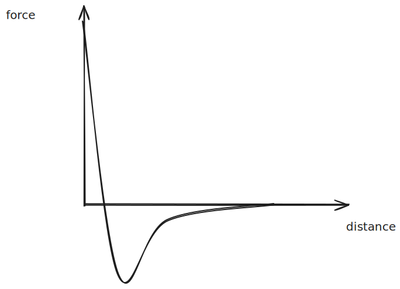

# Air-Water Mixtures

November 14, 2024

---

## Exam Remarks

- 4 Questions
- We are expected to know which cycles are which

## Mixture Fractions

We wan find the number of moles in something with:

$$ n_i = \frac{m_i}{M_i}$$ 
You can define a **mass fraction** as the fraction of mass of a particular species over the total mass:

$$ (mf) = \frac{m_i}{\sum m}$$ 
> He likes calling $(mf)$ just $f_i$ to avoid having two letters for one number. $(mf)$ is what the book uses; there's no physical difference.

$$ \sum _if_i = 1 $$ 
Similarly, you can make a **mole fraction**, which is:

$$ y_i = \frac{n_i}{\sum n},\ \sum_iy_i = 1 $$

With these fractions, you can calculate the molar mass of a gas composed of many other gasses:

$$ M = \sum _i y_i M_i $$

This is where $28.97$ comes from for the molar mass of air.

You can extend this logic to get different values:

- Molar specific internal energy is $\bar u = \sum_i y_i \bar u_i$ 
- Molar specific enthalpy is $\bar h = \sum_i y_i \bar h_i$ 
- Molar specific entropy is $\bar h = \sum_i y_i \bar h_i$ 
- Molar specific heats is $\bar c_v = \sum_i y_i \bar c_{vi}$  and $\bar c_p = \sum_i y_i \bar c_{pi}$

When we mention air, we often *neglect the water vapor* in the air, because this is variable and can largely influence the properties. For consistency, we usually only consider *dry air*.

### Gas Models

There are two different models for how gasses interact:

%%[🖋 Edit in Excalidraw](../../media/excalidraw/excalidraw-2024-11-14-14.16.11.excalidraw.md)%%

Depending on the mixture, either model will better represent the 

### Humidity 

**Relative humidity** ($\phi$) is the number of moles of water vapor relative to number of moles of water vapor at a saturated point. Assumes constant pressure and temperature.

$$ \phi = \frac{y_v}{y_{v, sat}} = \frac{P_V |_{T,p}}{P_G|_{T}} $$

%%[🖋 Edit in Excalidraw](../../media/excalidraw/excalidraw-2024-11-14-14.29.10.excalidraw.md)%%

It's possible to have a relative humidity slightly higher than 1; this happens when the dalton model breaks down. Here, the ideal gas law breaks down too.

However, in engineering, it's often more convenient to consider the **Humidity Ratio**:

$$ \omega =  \frac{M_v}{M_a} = \frac{M_{H_2O} P_v}{M_a(P-P_v)} $$

where:
- $M_v$ is the molecular weight the water vapor
- $M_{H_2O}$ is the molecular weight water
- $M_a$ is the molecular weight of air
- $P_v$ is the partial pressure of water vapor
- $P$ is the total pressure

### New Equation of State

When we get close to condensation, the ideal gas model falls apart. We can use these new equations when the ideal gas model doesn't work.

**Van der Waals forces** cause the molecules to attract each other, but if you push hard enough, they end up repelling eachoter. You end up getting this force curve:

%%[🖋 Edit in Excalidraw](../../media/excalidraw/excalidraw-2024-11-14-14.40.17.excalidraw.md)%%

To account for this, we use values $a$ and $b$ to account for this:
- $a$ represents how the *pressure shrinks due to repulsive forces*
- $b$ represents how the *specific volume shrinks due to attractive forces*

Van der Waals Equation of State

$$ p = \frac{\bar R T}{\bar v - b} - \frac{a}{\bar v ^2} $$

Redlich-Kwong Equation of state

$$P = \frac{\bar R T}{\bar v - b} - \frac{a}{\bar v (\bar v + b)T^{\frac 12}}$$
Virial Equation of state:

$$ \frac{p \bar v}{\bar R T} = Z = 1 + \frac{B(T)}{\bar v} + \frac{C(T)}{\bar v^2}  + \frac{D(T)}{\bar v^3}$$

*You can solve for values $a$ and $b$* by looking at the inflection point at the isotherm that passes through the critical point:

%%[🖋 Edit in Excalidraw](../../media/excalidraw/excalidraw-2024-11-14-14.43.00.excalidraw.md)%%

Mathematically, the inflection looks like:

$$(\frac{\partial ^2P_c}{\partial \bar v^2})_{T_C}=0,\ {\frac{\partial  P_c}{\partial \bar v}} = 0$$

Using this, you can then derive $a$ and $b$.

$$(\frac{\partial ^2 P_c}{\partial \bar v^2})_{T_C}= \frac{2 \bar R T_C}{(\bar v_c-b)^3} - \frac{6a}{\bar v_c^4} = 0 $$

$$ (\frac{\partial P_c}{\partial \bar v})_{T_C} = - \frac{\bar R T_C}{(\bar v - b)^2} + \frac{2a}{\bar v^3}=0$$

$$ a = \frac{27}{64} \cdot \frac {\bar R ^2 T_C^2}{P_C}, \ b=\frac{\bar R T_C}{8 P_C}$$

## Psychrometrics

Relationships between water vapor in the air.

Relative Humidity Ratio:
$$ \omega = \frac{m_V}{m_a} = \frac{m_Vp_V \frac{V}{\bar R T}}{M_aP_a \frac{V}{\bar R T}} = \frac{M_V}{M_a}\cdot \frac{P_V}{P_a} = 0.622 \frac{P_V}{P_A} = 0.622 \frac{P_V}{P-P_V}$$

Relative Humidity:

$$ \phi = \frac{y_v}{y_{v, sat}}|_{T,P} = \frac{P_V |_{T,P}}{P_G|_T}$$

> There will be one of these problems on the final.