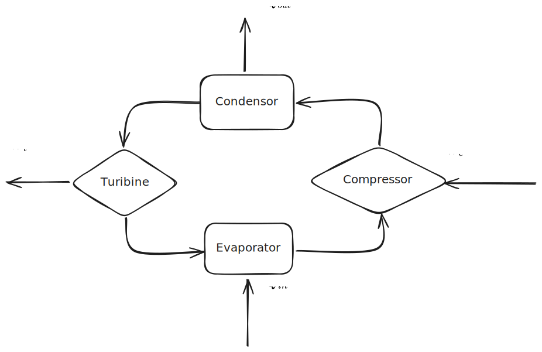
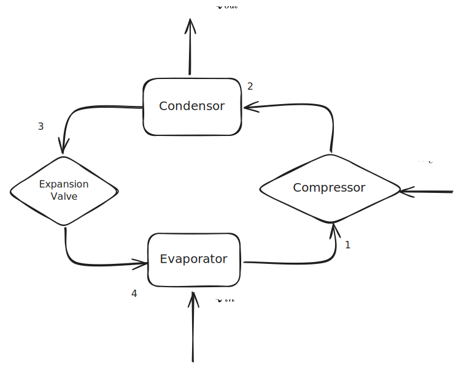
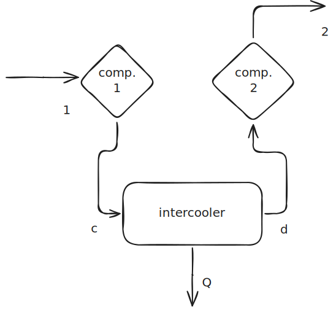
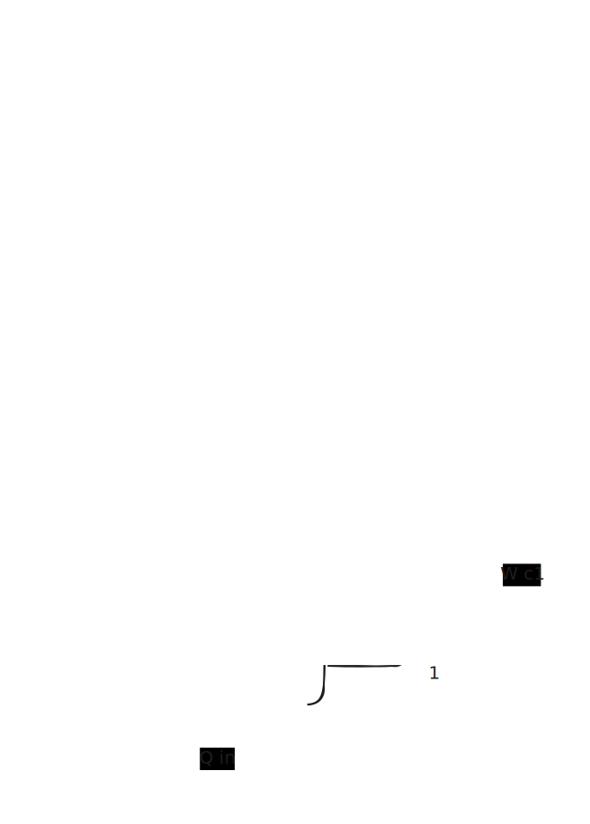
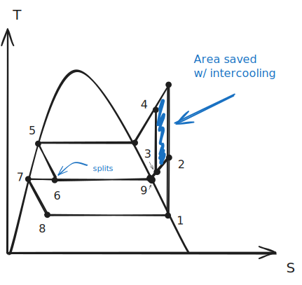
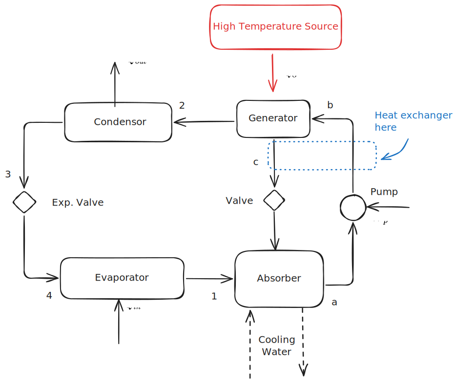
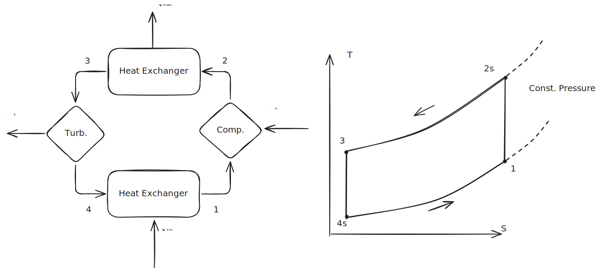
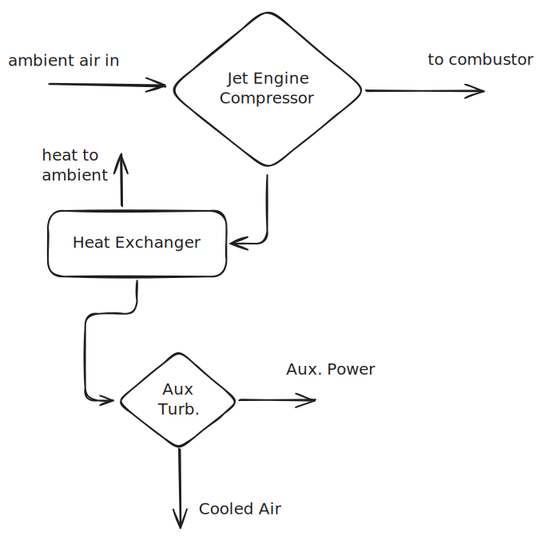

# Refrigeration Cycles (Textbook)
Chapter 9, [Lecture Notes](Refrigeration%20Cycles%20(Lecture).md)

---

### Vapor Refrigeration Systems

**Refrigeration systems** are exactly what they sound like they are; these are things like refrigerators, air conditioners, and liquid nitrogen generators.

**Heat pumps** are similar to refrigeration cycles, but their goal is to pump heat from a cold reservoir.

Both heat pumps and refrigeration systems require input work.

#### Carnot Refrigeration Cycle

A Carnot refrigeration cycle is a Carnot cycle that runs in reverse. Just like any other Carnot cycle, it operates between two reservoirs at $T_H$ and $T_C$ and its T-s diagram makes a perfect rectangle.

$$\beta_{max} = \frac{T_C}{T_H-T_C}$$ 
%%[🖋 Edit in Excalidraw](../../media/excalidraw/excalidraw-2024-11-08-18.20.01.excalidraw.md)%%

In this cycle, the cold temperature is typically below the surrounding temperature.

In the real world, there are many reasons a Carnot cycle is not feasible.
1. Running a compressor with a liquid-vapor mixture is complex; it's much easier to compress a vapor.
2. Putting a turbine in one of these systems is often unrealistic; instead, it's often switched for a #throttling-valve , which is a type of valve that maintains constant enthalpy between input and output.
3. Stray heat transfer causes irreversibilities, causing the cycle to stray from the perfectly rectangular Carnot cycle.

An actual cycle would look more like:

%%[🖋 Edit in Excalidraw](../../media/excalidraw/excalidraw-2024-11-08-18.20.02.excalidraw.md)%%

### Analyzing Ideal Vapor-Compression Refrigeration Systems

An ideal vapor-compression cycle will have the following T-s diagram:

#### Heat In

$\dot Q_{in}$ is called the **refrigeration capacity**. If KE, PE are neglected, *and it is assumed that pressure is constant across the evaporator,* we can find the heat in from the evaporator as:

$$ \frac{\dot Q_{in}}{\dot m} = h_1 - h_4 $$

> This makes sense because pressure is constant and temperature increasing. Perfect time to use enthalpy.

#### Compressor Work

Using a steady-state control volume analysis where $\dot Q_{cv}$ is neglected, along with kinetic and potential energy, we can show that work into the compressor is:

$$\frac{\dot W_{c}}{\dot m} = h_2 - h_1$$

> I think this abandons the sign convention that work in is negative. Just be ready for that.

#### Rejected Heat

Just like we did for heat in over the evaporator, the heat out over the compressor can be derived with:

$$ \frac{\dot Q_{out}}{\dot m} = h_2 - h_3 $$

> Again, I'm pretty sure this abandons the sign convention where heat out is usually negative.

#### Expansion Valve

The primary characteristic of a #throttling-valve (which I assume is analogous to an expansion valve??) is that the *enthalpy across it* is constant. In this case, this means

$$h_4 = h_3 $$

Note that, **across an ideal expansion valve, entropy is not constant.** If entropy were constant across the expansion valve, it would be impossible for the state to change—hence, there is some unavoidable heat transfer across the valve. **Throttling processes are inherently irreversible.**

#### Coefficient of performance

The coefficient of performance of a refrigeration cycle is

$$ \beta = \frac{\dot Q_{in}/\dot m}{\dot W_c / \dot m}= \frac{h_1-h_4}{h_2-h_1} \tag{9.2e}$$

### Analyzing real vapor-compression systems

In real vapor compression systems, we must consider the #isentropic-efficency of the compressor:

$$ \eta_c = \frac{(\dot W_c / \dot m)_s}{(\dot W_c /\dot m)} = \frac{h_{2s}-h_1}{h_2-h_1} $$

Additionally, *superheated vapor exists the evaporator* (state 1) (as compared to the saturated vapor in the ideal system) and *subcooled liquid exits the condenser* (as compared to the saturated liquid in the ideal system).

The $T_H'$ condenser temperature operates above the hot reservoir temperature, and the $T_C'$ evaporator temperature operates below the cool reservoir temperature.

### Pressure-Enthalpy Diagrams

The high-slope lines to the right of the vapor dome are constant entropy values. The intersecting lines that point downwards are isotherms. 

You can use these with refrigeration cycles to quickly look up values. The constant entropy lines make it easy to find the idealized compressor output (i.e., $2s$). Additionally, across the #throttling-valve it is known that enthalpy is constant, so you can, again, quickly loop up values.

### Selecting Refrigerants

There are three primary factors to consider when selecting a refrigerant:
1. Performance
2. Safety
3. Environmental Impact

##### Performance
It's generally desirable, for practical reasons, to avoid excessively low pressures in the evaporator and excessively high pressures in the condenser. Additionally, the type of compressor in use will govern what density and pressure the refrigerant can operate at.

##### Environmental
CFCs (chlorofluorocarbons) and HCFCs (hydrochlorofluorocarbons), commonly called *freons* were created to be ultra-stable. Prior refrigerants, dating to before the 1930s, were highly toxic and flammable. These new CFC refrigerants were R-11, R-12, R-113, and R-114, and shortly after came the first HCFC refrigerant R-22.

The *Global Warming Potential (GWP)* is an index that estimates the rough influence that a gas would have on global warming if it were released into the atmosphere. As a reference $CO_2$ has a GWP of 1.

Some of these refrigerants, notably R-12, had massive GWPs; R-12 had a 10200 GWP, with others in the 3000-5000 range.

Additionally, these CFC and HCFC modules are very long-lasting and were noticed to damage the ozone layer. In 1987, it was agreed upon to ban these chlorine rich refrigerants, and a new refrigerant, R-134a, was developed to replace R-12 and its counterparts. However, R-134a still has a high GWP, and it's currently under scrutiny when more environmentally sustainable options, namely, $CO_2$ (aka R-744) and R-1234yf exist.

Natural refrigerants, such as ammonia have been used since the very start and are continued to be used in many industrial applications. Ammonia, also called R-717 for some reason, stepped in to replace R-12 in many ways. Nowadays, you can use thermoelectric devices like [Peltier module](https://en.wikipedia.org/wiki/Thermoelectric_cooling) to cool without any refrigerant.

### Other Vapor-Compression Applications

#### Cold Storage

You can chill water during off-peak power periods, then use the "stored cold" to cool down a home or building.

#### Cascade Cycles

Cascade cycles link two vapor compression cycles in series with a counterflow (idk if its always the case) heat exchanger in series.

> I suppose this just helps with the practicality of implementing a refrigeration cycle across a large temperature gradient?

The coefficient of performance for one of these cycles is:

$$ \beta = \frac{\dot Q_{in}}{\dot W_{cA} + \dot W_{cB}} $$

The mass flow rates in the two cycles may or may not be the same, and there may be two or more cycles in series.

#### Intercooling 

##### Intercooling Principle

From [Control Volume Work](Control%20Volume%20Work.md), it is known that the work *in a control volume* is:

$$ \frac{\dot W_{cv}}{\dot m} = - \int \limits _1^2 vdp$$

$$Shaded \ Area \propto Work$$

This, if we reduce the temperature during the compression of a fluid, we can reduce the total work. The updated p-v diagram is:

The dark shaded region is the *work saved*. The component diagram for this looks like:

%%[🖋 Edit in Excalidraw](../../media/excalidraw/excalidraw-2024-11-08-20.27.08.excalidraw.md)%%

Intercooling is used in regenerative gas turbines alongside vapor refrigeration cycles; the principle is identical—all you're doing is reducing compressor work.

##### Integration with Refrigeration Cycle

You can combine this intercooling with a larger refrigeration cycle. The diagram for this is shown below:

%%[🖋 Edit in Excalidraw](../../media/excalidraw/excalidraw-2024-11-09-09.44.50.excalidraw.md)%%

The T-s diagram for this system is:

%%[🖋 Edit in Excalidraw](../../media/excalidraw/excalidraw-2024-11-09-09.49.44.excalidraw.md)%%

The **flash chamber** *separates the two-phase liquid-vapor* coming into at state 6 into two streams. *Saturated vapor is diverted into the heat exchanger* and *saturated liquid* is diverted to state 7. 

The *mass flow rate* of saturated vapor out of the flash chamber *is related to the quality* of the steam. The fraction of saturated vapor flow rate is $x$ and the fraction of saturated liquid flow rate is $(1-x)$. 

### Absorption Refrigeration

Instead of compressing a vapor between the evaporator and the condenser, an absorption refrigeration cycle uses an *absorbent*, which is a secondary substance, to absorb the refrigerant and turn it into a *liquid solution*. The liquid solution is then *pumped* to the higher pressure.

By pumping a liquid instead of compressing a gas, you can significantly reduce the amount of work required because the average specific volume of the liquid is much less than the specific volume of the vapor. 

These absorption cycles need to then retrieve the refrigerant from the absorbed solution, which generally entails a high-temperature source. This is often derived from waste heat that already exists. 

%%[🖋 Edit in Excalidraw](../../media/excalidraw/excalidraw-2024-11-09-10.09.41.excalidraw.md)%%

The Generator receives heat and *recovers the refrigerant from the solution* and pumps the absorbent back. The process of absorption is an exothermic process, hence the cooling water required. The overall result of this cycle is a *reduced work input, but an increased heat input.*

One final addition you can make is to add a **rectifier** before the condenser, which removes any traces of water from the refrigerant before it enters the condenser. If water is in the refrigerant, it might freeze and expand, damaging the condenser.

You can also place a heat exchanger between the weak solution return pip and the strong solution pipe to recover some of the absorbent heat: 

%%[🖋 Edit in Excalidraw](../../media/excalidraw/excalidraw-2024-11-09-10.09.42.excalidraw.md)%%

### Heat Pump Systems

Heat pumps operate similar to refrigeration cycles, except their objective is to deliver $\dot Q_{out}$, instead of $\dot Q_{in}$ in a refrigeration cycle.

In a **Carnot heat pump**, the maximum coefficient of performance is: 

$$ \gamma_{max} = \frac{T_H}{T_H-T_C}$$

This coefficient of performance is never less than 1. If there is no cold reservoir, the coefficient becomes 1.

However, like refrigeration cycles, heat pumps seldom pull off a true Carnot cycle; instead, *vapor-compression heat pumps* are used, which have the same basic components as a vapor-compression refrigeration cycle.

### Gas Refrigeration Systems

In a gas refrigeration system, the working fluid remains a gas for the entire cycle. The **Brayton Refrigeration Cycle** is an example of one of these cycles. It operates just like a Brayton power cycle, just in reverse.

%%[🖋 Edit in Excalidraw](../../media/excalidraw/excalidraw-2024-11-09-12.27.17.excalidraw.md)%%

Some key equations are:

$$ \frac{\dot W_c}{\dot m} = h_2 - h_1,\ \ \frac{\dot W_t}{\dot m} = h_3 - h_4$$

$$ \frac{\dot Q_{in}}{\dot m} = h_1 - h_4 $$

In a Brayton refrigeration cycle, *the turbine work is non-negligible*—unlike vapor refrigeration cycles.

> If given a **compression ratio**, just know that equates to $r_c = \frac{p_2}{p_1}$ 

#### Additional Gas Refrigeration Applications

Gas refrigeration cycles are usually less realistic than vapor refrigeration cycles, however, they can achieve much lower temperatures (around -150°C) than vapor refrigeration cycles.

Aircrafts also take advantage of their large jet engine compressors to cool the cabin.

%%[🖋 Edit in Excalidraw](../../media/excalidraw/excalidraw-2024-11-09-12.41.34.excalidraw.md)%%

