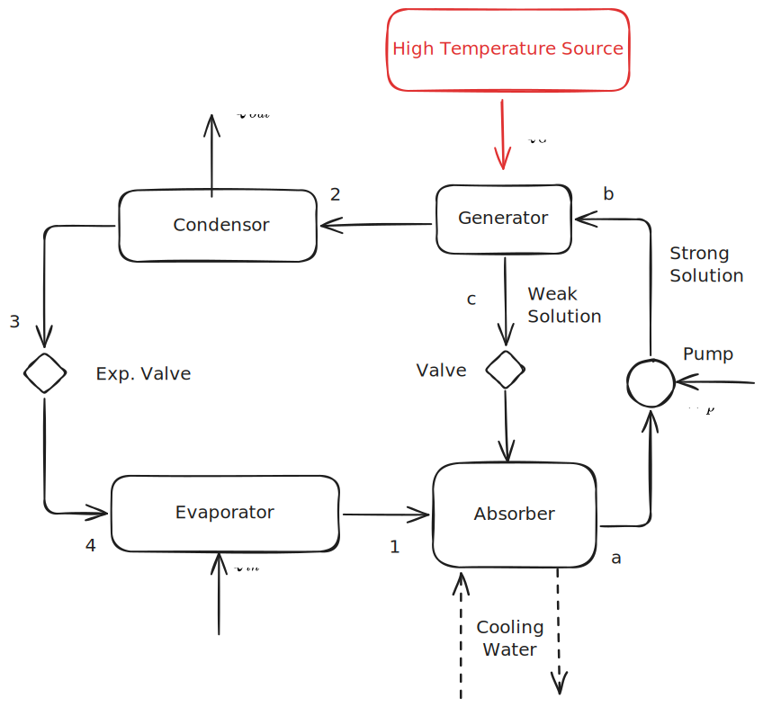
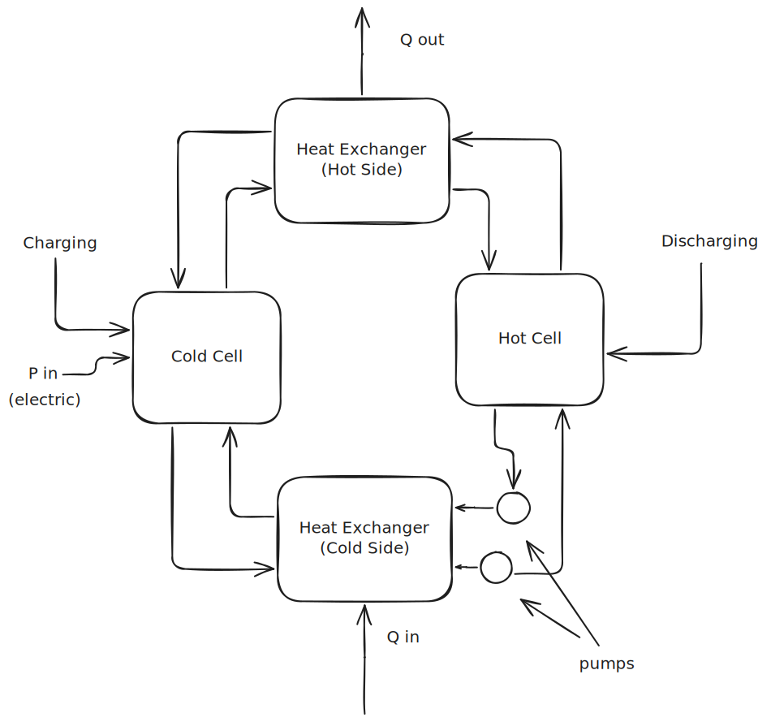
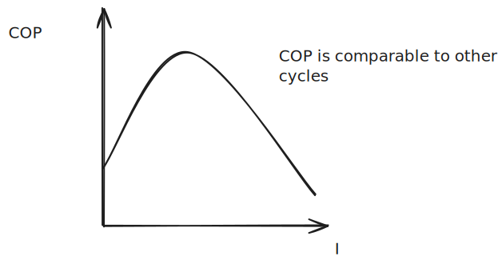

November 12

--- 

## General Comments

Next midterm will include: Rankine cycle, gas power cycles, refrigeration

No more homework, but more content will be covered *that will appear on the final* (one of the four questions).

#### Ammonia-Water Absorption Refrigeration

> Wants to clarify some stuff that was discussed last chapter

In vapor-compressor coolers, the compressor takes a lot of energy. This compressor is used in almost every refrigerator, air conditioner, etc.

A two-phase ammonia-water substance allows you to reduce the input work to achieve the same cooling.

The left hand side is exactly the same as any other refrigerator, but the right hand side *uses heat instead of extra pump work*. 

The absorber is what *mixes ammonia with water*. This is then pumped through the pump into the generator, where heat separates the ammonia out from the water again. 

## Scalable Thermal Engineering

> Some of Dr. Yee's research

He works in the Scalable Thermal Energy Engineering Laboratory (STEEL).

Have to find a way to reduce **51 Billion Tons** of greenhouse gasses to zero in only 25 years. There are five main things that have to change to achieve this:

1. Manufacturing (31%)
2. Electricity Consumption (27%)
3. Agriculture (19%)
4. Transportation (16%)
5. Heating and Cooling (7%)

There is a nitrogen cycle (relating to Agricultures impact) that is not closed. We end up polluting a lot to create enough nitrogen for our fertilizers. 

The heating and cooling percentage is *growing quickly*, and it probably will continue to grow. Right now, there are **1.2 billion** air conditioner units, but by 2050, there is *projected to be **4.5 Billion** air conditioner units*. 

Of these air conditioners, vapor compression is very popular. It's very cheep, efficient, and scalable, but it *only achieves 14% of the Carnot coefficient of performance.* Additionally, these compression cycles run with high GWP refrigerants. 

After the **Montreal Act**, CFC refrigerants became illegal, so HFCs are very common. However, these HFCs continue to have *very high GWPs*. Right now, there aren't a lot of solutions for this—$NH_3$ systems can leak and suffocate people and butane/propane cycles are susceptible to fires.

### Existing Cycles

You can run all of these Rankine, Stirling, Ericson, etc. cycles in reverse.

#### Experimental
G3P3 power plant is a new type where solar energy is used to heat a supercritical $CO_2$ Brayton cycle. Currently under construction in New Mexico.

## Electrochemical Power Generation & Refrigeration 

> This stuff won't show up on exams—it's really just him sharing his research.

A Georgia Tech student hypothesized that you could create refrigeration by charging and discharging a battery. At MIT, it was proved that you could generate energy from these cells.

Dr. Yee researched how you could use this principle to create an **Electrochemical Brayton Cycle**. 

%%[🖋 Edit in Excalidraw](../../media/excalidraw/excalidraw-2024-11-12-14.45.07.excalidraw.md)%%

The team successfully demonstrated that this cycle can indeed produce a cooling effect, and found that the cooling load *peaks around 2A* (for their prototype) and decreased in either direction.

%%[🖋 Edit in Excalidraw](../../media/excalidraw/excalidraw-2024-11-12-14.50.41.excalidraw.md)%%

For the system, he came up with the governing equation:

$$ \dot V C_v \frac{dT}{dx} = (\frac{\vec I \cdot \hat n}{L_e}(-\eta - \alpha T))$$

where :
- $\alpha$ is the temperature coefficient
- $c_V$ is the specific heat
- $L_e$ is the electrode length
- $\vec I \cdot \hat n$ is the current
- $\dot V$ is volumetric flow rate
- $\eta$ is over-potential

This makes it possible to hit about 50% of the Carnot coefficient of performance, which is four times more efficient than the vapor compression systems of today. There were some issues with getting a high temperature gradient, but a Chinese lab was able to increase the previous experimental gradient by tenfold.

> There are a *lot* of parameters you could optimize to increase your yield—chemically and physically.

