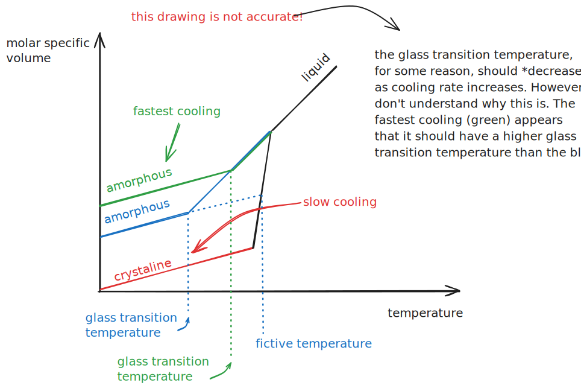
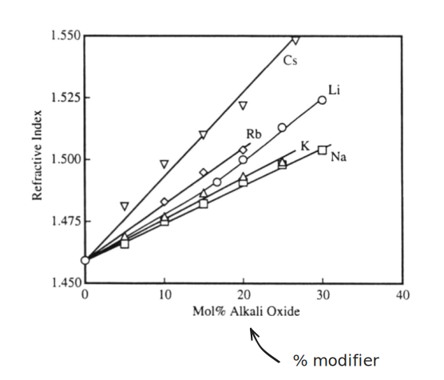

# Amorphous Solids

## Glasses

Glasses are *non-crystalline* solids. They are *disordered*, meaning they are *amorphous solids*. 

Amorphous solids don't have any LRO (long-range order).

LRO is found in only crystalline substances, whereas amorphous materials only have SRO. 

The **x-ray diffraction** of amorphous solids will produec a hump, rather than discrete spikes. Below, $SiO_2$ is amorphous, and the others are crystalline. Although all these substances have the same elements, their structure makes them behave much differently. 

Glasses can be thought of as a **supercooled liquid**. As liquids are cooled, their viscosity (usually) increases. This is because atoms have stop having the energy required to move between each other. 

### Glass Transition

Depending on how fast you cool a glass, you get different properties.

%%[🖋 Edit in Excalidraw](../../media/excalidraw/excalidraw-2024-12-07-18.15.21.excalidraw.md)%%

This **glass transition temperature** is the point where the T-v diagram deviates from that of the liquid; this correlates to when the glass solidifies. In reality, it's not as sharp as this diagram—there's a gradual region.

As the glass cools, crystals form, so by cooling quicker, you can force the glass to be stuck in an amorphous phase before crystals can form. The quicker the cooling, the less time for crystallization.

The **fictive temperature** is the hypothetical temperature that is achieved by tracing solid line back to the liquid line. This fictive temperature describes the temperature that the glass would need to be quenched at (assuming the quench transfers heat instantly) to achieve an equivalent solid. It describes what temperature the glass is frozen in on that liquid curve.

## Refractive Index

You can approximate the refractive index by looking at the electron density of a material. *The refractive index is roughly proportional to electron density*. 

If stoichometry is constant, the refractive index is roughly proportional to density:

## Modifiers

Adding modifiers to a material makes its structure less ordered/directional. In turn, this makes a material *less rigid* and decreases the glass glass transition temperature.

The amount of modifier in a glass increases its refractive index

%%[🖋 Edit in Excalidraw](../../media/excalidraw/excalidraw-2024-11-10-16.30.00.excalidraw.md)%%

These modifiers add **wiggle-ability** (idk if its actually called that), which basically means that atoms are more free to move around.

As a consequence, the glass transition temperature usually decreases when modifies are added.

### Hydrogels
Hydrogels are not soluble in water because of their cross links.

They are this type of thing.

### Crystalline Polymers
Most polymers are amorphous. However, there are a subset of polymers that crystalize. 