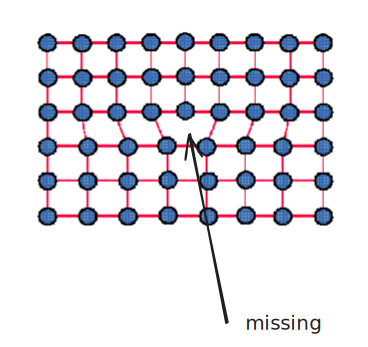
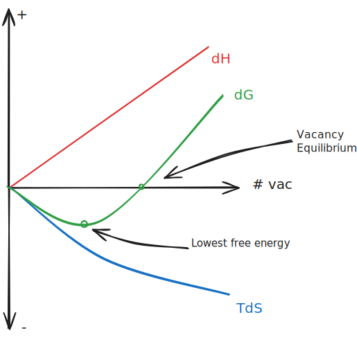
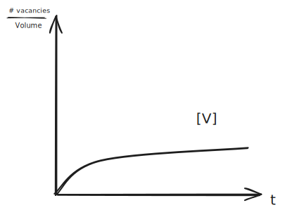
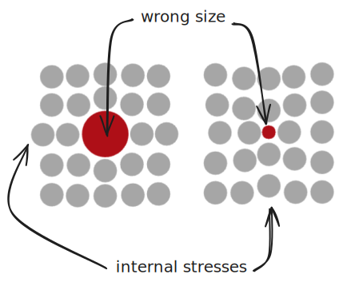
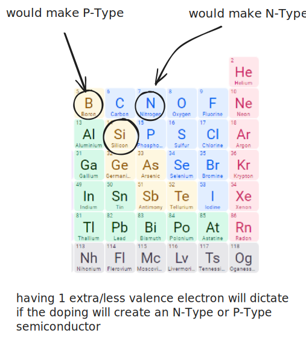

# Defects in Materials

There are different dimensions of the defects to consider:
- Point Defects (0-D)
	- Small vacancies in a lattice or crystal.
	- 
- Linear Defects (1-D)
	- Edge dislocations, where a line or plane of atoms is misplaced.
	- 
%%[🖋 Edit in Excalidraw](../../media/excalidraw/excalidraw-2024-11-12-09.37.46.excalidraw.md)%%
- Planar Defects (2-D)
	- Misplaced boundaries, stacking faults
	- 
- Volume Defects (3-D)
	- Pores, cracks, inclusions, etc.

Generally, it takes energy to form a defect; the potential energy of the material is higher with defects than without defects.

The surface of a material, where the repeating units are broken, is a good example of a defect. All materials have some amount of defects.

## Vacancy Formation

Having random defects increases the **entropy** in the system. 

$$ dG_{vac} = dH_{vac} - TdS_{vac}$$

where:
- $dG_{vac}$ is the "free energy" required per vacancy formation
- $dH_{vac}$ is the change in enthalpy per vacancy formation
- $T$ is temperature
- $dS_{vac}$ is the change in entropy per vacancy formation

If $dG_{vac}$ is positive, vacancies will not form spontaneously; however, if it's negative, they will form spontaneously. Thus, a higher $dS_{vac}$ term will create a more spontaneous process.

%%[🖋 Edit in Excalidraw](../../media/excalidraw/excalidraw-2024-11-12-09.48.15.excalidraw.md)%%

The **Arrhenius Equation** gives the probability for an atom to undergo a process that has a potential energy barrier (very handwavy).

Roughly:

$$p \propto e^{-\frac{∆E}{k_bT}}$$
where:
- $p$ is the probability of creating a vacancy 
- $∆H$ is the enthalpy required to break a bond
- $k_b$ is the Boltzmann constant
- $T$ is the temperature

If you know the probability of a vacancy existing, and the number of lattice sites, you can *predict the concentration of vacancies in a material.*

$$ N_V = N_L \cdot e^{-\frac{∆E}{k_bT}} $$

where:
- $N_V$ is the number of vacancies
- $N_L$ is the number of lattice sites.

You can express the *concentration* of the vacancies in the material using a constant too:

> His derivation makes zero sense, but nothing in this class is real so womp womp.

$$ [V] = A\cdot e^{-\frac{∆E}{k_bT}}$$

where $[V]$ is the vacancy concentration.

%%[🖋 Edit in Excalidraw](../../media/excalidraw/excalidraw-2024-11-12-10.00.54.excalidraw.md)%%

#### Ionic Defects
A **Schottky** defect is a defect in which there is a ratio of anion to cation vacancies that cancel each other out so that the effective charge balances.

A **Frenkel** defect occurs when an atom is misplaced (but not absent), which creates both a vacancy and an "interstitial." The charges continue to balance.

In this substance...

we would say that there is a *substitutional Mg impurity on a Na site.* The charge here will be +1 greater than the pure compound.

## Point Defects

Point defects are effectively the opposite of vacancies.

> 🤖 (notecheck comment) - A vacancy is itself a type of point defect, so it is not correct to say that point defects are the opposite of vacancies. Possibly you meant that self-interstitials are effectively the opposite of vacancies.

%%[🖋 Edit in Excalidraw](../../media/excalidraw/excalidraw-2024-11-12-10.05.10.excalidraw.md)%%

Adding these impurities in tiny concentrations (1/10,000 atoms) can drastically influence the properties of a material.

You can "**dope**" semiconductors with impurities like this to create both N-Channel and P-Channel semiconductors:

%%[🖋 Edit in Excalidraw](../../media/excalidraw/excalidraw-2024-11-12-10.21.40.excalidraw.md)%%

Usually, you have to stick in the +1 or -1 range—going further causes practical issues.

## Alloys

Also called **Substitutional Solid Solutions**.

Impurities become an integral component of the material. They remain *randomly arranged*.

The minor component is the solute, and the major component is the solvent—the same as in an aqueous solution.