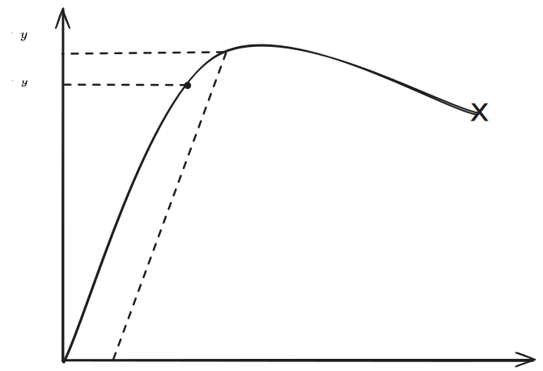

# Dislocations

Plastic deformation requires bond breaking and moving. At the atomic level, these are always from *shear stresses* (not normal stresses).

Tensile loads an obviously still cause deformation, but it causes a type of shear deformation:

The *ideal yield strength* is found from the force required to break all the bonds in a plane. However, this ideal strength does not match the measured yield strength (off by orders of magnitude).

In reality, there is *dislocation motion (glide)*. You need to break a *line of bonds*, not an entire plane of bonds. In reality, the true yield strength is a lot lower.

A *edge dislocation* defect lowers the energy required to shift the atoms. The dislocation "glides" down the lattice. We call this a *dislocation glide*.

Impending this dislocation motion tends to increase yield strength; enhancing tends to increase ductility.

These disloactions occur along the path of least resistance. This is usually the shortest "hop" between bonds.

#### Slip Planes

Crystaline planes with the highest atomic packing density (atoms per unit area).

If you're asked to find which plane (given miller indicies) has the higest atomic packing density, count the number of atoms that intersect that plane.

#### Slip Directions

Crystalline directions with the highest linear packing density (atoms per unit length)

### Slip Systems

Slip Systems = Slip Planes + Slip Directions

Notation is `{family of planes}<family of directions>`

The greater the number of *unique* slip systems in a material, the easier it is to plastically deform (generally).

To be a **unique** slip system, *slip planes cannot be parallel to each other, and slip directions cannot be collinear.*

> BCC breaks the ductililty to slip system relationship because its not a closed packed system

## Strengthening Mechanisms

By adding solute atoms, large particles, or other types of defects, it can make it more difficult for dislocation motion to occur. You effectively put obstacles in the path.

The bond type and atomic packing density will influence how much the material is strengthened. 

#### Solid Solution Hardening
*Solid Solution hardening* adds solute atoms into the lattice. The yield strength is related to the concentration of the impurity by: 

$$ \sigma _y \propto \sqrt {c}$$

where $c$ is the concentration percent and $\sigma_y$ is the yield strength.

#### Precipitation Hardening
*Precipitation Hardening* adds a large precipitate particle. This strengthens in two ways:
- Cuts through dislocation slices
- Increases the path of least resistance required to glide.

#### Work Hardening

After a material reaches its yield strength and then is unloaded, its yield strength will increase because it has be **work hardened.** 

This is the same effect as cold rolling a material. You are inducing dislocations.

- Internal stresses are formed
- Grains are deformed
- Dislocations are added
- Decreases ductility but increases yield strength.

**Hot working**:
- Above the recrystallization temp
- Doesn't influence internal stresses or grain
- No dislocations are added
- Keeps lower yield point and higher ductility

%%[🖋 Edit in Excalidraw](../../media/excalidraw/excalidraw-2024-12-08-15.08.40.excalidraw.md)%%

#### Grain Boundary Hardening (Hall-Petch strengthening)

You can decrease grain size by adding nucleates. The *smaller your grains, the higher shear strength*. The physical process for achieving this is rather complicated, but the general trend towards increased strength for smaller grains is all that's important for this class.

$$\tau_{GB} \propto \frac{1}{\sqrt{D}}$$

where:
- $\tau_{GB}$ is the strength from grain boundaries
- $D$ is the grain size

### Burger Vectors

Shows how a dislocation slip changes the crystal.

To find the burger vector,
1. Count the number of atoms in the grid on the top, then on the right, then on the bottom, then on the left. Basically jut find the shape of the lattice sample.
2. If you end up where you started, there is no burger vector, but if you finish at another point, the burger vector points between your finish and your start

You have to take *the same number of steps* in either parallel direction (3 and 4 in the example above).

## Total Yield Strength

$$ \tau _y  = \tau_{lattice} + \tau _{ss} + \tau_{ppt} + \tau_{d}+\tau_{gb}$$

- $\tau_{ss}$ is from solid solution
- $\tau_{ppt}$ is from precipitate
- $\tau_{d}$ is from dislocations
- $\tau_{gb}$ is from grain boundaries
- $\tau_{lattice}$ is from the lattice itself and cannot be changed

