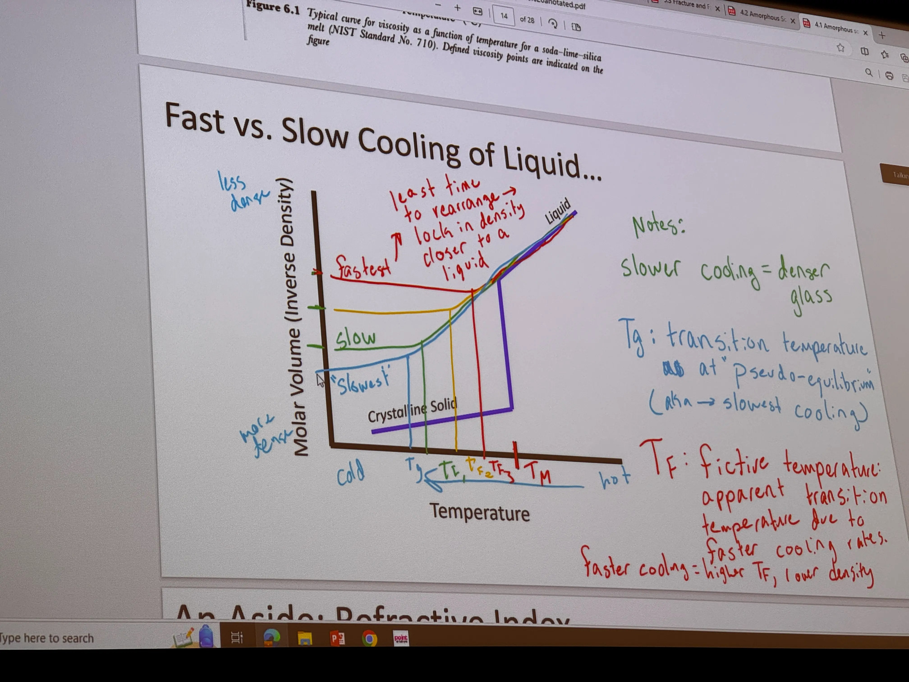

# Exam Notes

Some general notes from studying for the final

---

- Hard magnetic materials retain their magnetization after the magnetic field is gone—soft magnetic materials don't.
- Randomly polarized light will obtain a preferential polarization after reflection, even if the surface is smooth.
- Randomly polarized light will decrease in intensity by 50% when encountering a polarizer.
- A sacrificial anode should have a higher Standard Reduction Potential than the substance it is protecting.
- You cannot have 5-fold symmetry in a crystal
- A hexagonal crystal will have 6-fold rotational symmetry

## Questions

- What is galvanic corrosion
	- [Galvanic Corrosion](Galvanic%20Corrosion.md)
- What is the difference between anodic and cathodic corrosion 
	- Cathodic protection is protection from a sacrificial anode 
	- Anodic protection is stainless steel stuff, which isn't covered in this class.
- Which of the BCC, FCC, HCP isn't close packed
	- BCC is not close packed
- Ceramics tend to be resistant to corrosion 
- Will all cubic unit cells have a coordination of 6
	- No, it depends on if it's primitive (6), BCC (8), or FCC (12)
- How do you find the coordination number
	- The coordination number is the # of nearest atoms. But you can just memorize the numbers for the few crystals on the exam.
- What in the world is going on here:
	
	- This is a BCC unit cell, so we know that *there are 2 lattice points*. If we count the number of atoms, we see there are two oxygens and four coppers. Now, if we divide this count by the number of lattice points, we get the basis, which is 1 oxygen and 2 copper.
- Is this question missing an equals sign:
	
	- idunno
- How do we get to this conclusion?
	  
	- The depth of the curve of the curve is proportional/related to the melting point.
- What is fatigue failure
	- Propagation of micro-cracks until failure
- What is shot peening
	- Like super-sandblasting a material to put small divots in its surface. These divots are under compression, and help the material resist micro-cracks, and hence, fatigue failure. [Fracture and Failure](Fracture%20and%20Failure.md)
- What is fictive temperature
	- Fictive temperature is the an aparent temperature that describes how a glass is frozen in place. [Amorphous Solids](Amorphous%20Solids.md)
- What is creep
	- [Structure of Polymers](Structure%20of%20Polymers.md), has to deal with constant stress applied over time
	- There is also stress relaxation too
- What is cyclic loading
	- Series of loading and relaxing
- What is dislocation motion vs climb
	- *Not sure where climb comes from*
	- Dislocation motion is the sliding along a line of bonds. [Dislocations](Dislocations.md)
- What is "diffusion through the bulk" and "diffusion through the grain boundaries"
	- *Also not sure where this comes from*
- What is "Charpy Impact Testing"
	- You measure how much energy a pendulum absorbs when breaking a material by looking at its gravitational potential energy change during the swing. [Fracture and Failure](Fracture%20and%20Failure.md)
- What is "Dilatometry"
	- The study of how materials change with time and temperature. Most relevant is its study of the CTE and phase changes.
- What is the Weibull distribution and how does this relate to a "shaper parameter" and "characteristic lifetime"
	- A probability function of a material to fail after some period of time. [Fracture and Failure](Fracture%20and%20Failure.md)
	- Shaper parameter is the $\beta$ in the equation
	- Characteristic lifetime is $N_0$ which is when like 63% (double check that number) of samples fail.
- What is phase assemblage
	- A term describing a combination (assembly) of phases in a material.
- What is solid state diffusion
	- If a material is hot enough, particles can diffuse through a solid lattice, just like (kinda) through a liquid. The activation energy is much higher, however.
- What does flame polishing do?
	- Makes a rough surface seem clear. [Structure of Polymers](Structure%20of%20Polymers.md)
- How can we tell which materials are susceptible to creep?
	- Do we have to?
- Why does the Ti-5Al alloy fail but 4340 steel doesn't at $10^5$ cycles at 500 MPA
	
	- I think I might have misread this?
- Is it always fair to extrapolate in situations like this? Apparently you can tell that Ductile cast iron won't fail under 200 MPA at $10^9$ cycles
	
	- If there is a horizontal line, then you can extrapolate the behavior for $\infty$ cycles.
- What is Binary Isomorphous Diagrams
	- If something follows the Hume-Rothary rues, it will have a binary isomorphous phase diagram
- What is the lever rule? 
- Ecliptic points/diagrams????
	- It looks like the pikachu one
- You cannot predict the melting point only given two materials, unless you have the phase diagram.
- Entropy drives vacancies  
- No questions on acoustic impedance
- How do BCC/other crystals change with cooling and brittle modes???
- Look up some of the polymer crystallinity stuff
- Viscoelastic materials
	- [Structure of Polymers](Structure%20of%20Polymers.md) under Time Dependency
	- Deborah number?
- Cooling rate of glasses
	- 
- What are the results of adding modifiers?
	- Lowers glass transition temperature lower
- X-Ray Scattering can be used to find out short range order to get a radial distribution function.
- We need to know the dimensionality of our defects.
	- Dopants are point defects
- Need to tell if something is an n-type or p-type
	- If you need to find a dopant for a compound, you need to be told which individual atom to look at
	- If an atom is to the right of the semiconductor atom on the periodic table, it will be an N-type. If it's to the left, it will be a P-type.
- Need to know defect notation
	- $V_{A}^{+1}$ 
- Memorize the hume rothary rules
	- i dont wannaaaaa
- Heavier elements will increase the intensity of x-ray diffraction 
- Quasi-crystaline patterns?
- Crystals need translational symmetry
- 360/#num folds is the degree  rotation that has to make the same shape
- 5,7,8,9, and higher fold rotational symmetries 
- What the fuckkk is coordination number
	- The number of nearest neighbors atoms.
	- 
- Remember ABCABC and ABAB
	- in my notes
- Which of FCC, HCP, Etc. are close packed?
	- FCC and HCP; BCC is not
- FCC always has four lattice points, you multiply this by the basis to get the number of atoms in the unit cell.
	- Remember the number of lattice points for each type of cell
	- You can use this to solve for the basis
	- $\text{\#lattice points} \times \text{\#atoms basis} = \text{\#atoms in unit cell}$ 
- Don't worry about polymer synthesis routes; these will not be on the test.
- What the hell is fick's first law (ch 1.5)
- Galvanization is a diferent metal. Usually iron coated in zinc. 
	- *Cathodic* protection uses a sacrificial *anode*. 
	- [Galvanic Corrosion](Galvanic%20Corrosion.md)
- A high stiffness (elastic modulus) will have the tightest curve in the bond-energy graph. 
	- ok.
- Remember that the CTE from a bond length graph comes from the asymmetry, not the energy vs distance alone. 
	- ok.
- Hard vs Soft magnets are a totally different hard/soft than from the mechanical world.
	- ok.
- What is the coercive field, in regard to magnetization
	- The H-intercept on the M-H curve where M switches direction.
- At saturation magnetization, you could stretch the saturation line to $H \rightarrow \infty$ 
- Thermal Diffusivity
	- High conductivity with low heat capacity
	- Proportional to conductivity / capacity
- What is the Pauling equation
	- It gives you %ionicity from the difference in electronegativities
	- $\% \text{Ionic Character} = 100 \times \left( 1 - e^{-0.25 (\Delta \chi)^2} \right)$
- What is Kröger-Vink Notation
- 

Fracture is a direct result of *crack propagation*

## Practice Final

❌✅

1. B ✅
2. B ✅
3. C ❌ (A)
	1. I think dislocations increase elastic modulus
	2. It increases the yield strength, not the elastic modulus. Think about [Work Hardening](Dislocations.md#Work%20Hardening) and how it shifts the stress-strain curve. Imagine stacking this new curve over the original curve. 
4. E ✅
5. A ✅
	1. I would expect this to be true, because going from gas to liquid rejects heat (exothermic).
	2. This intuition seems correct.
6. A ✅
	1. Not sure at all
7. C ✅
8. D ✅
9. C ✅
10. D ✅
11. A or C ✅
12. B ✅
	1. I think A would also influence this, but I can't imagine that being the primary factor
13. D ✅
14. D ✅
15. B ✅
16. E ✅
17. B ✅
18. A ✅
19. D ✅
	1. I had to look this one up
20. C ✅
21. C ✅
22. E ✅
23. B ✅
24. C ✅
25. A ✅
26. B ✅
27. E ✅
28. D ✅
29. D ✅
30. A ✅
	1. I'm assuming the most nucleations gets the smallest grain
	2. Yep, that's correct
31. E ❌ (C)
	1. It's not asking for the basis; it's asking for the number of atoms in the unit cell.
32. A ✅
	1. Seems to have the most unpaired electrons
33. D ✅
34. B ✅
35. D ✅
	1. Joules/Area  = $\frac{N\cdot m}{m^2} = \frac{N}{m}$ , I honestly don't know
	2. The answer is $Pa \cdot \sqrt m$ , so $\frac N{m^2} \cdot m^{0.5}$ 
36. A ✅
37. B ✅
38. C ✅
39. A ✅
40. A ✅
41. D ✅
42. D ✅
43. A ✅
44. C ✅
45. B ✅
46. E ✅
47. B ✅
51. ? ❌ (A)
	1. no clue, don't think this was covered
	2. I think this question is missing something; what defines point b?
52. B ✅
	1. Guessing that it wouldn't be a schottky defect if the charges don't balance 
53. B ✅
	1. I'm just looking for double carbons that are unboned on the side
	2. Yes, I think this is what they were talking about when they were talking about double bonds.
54. ? ❌ (C)
	1. No clue bro
55. C ✅
56. B ✅
	1. I think it should decrease. It lowers the melting point?
57. D ✅
58. D ✅
59. A ✅
60. C ✅
61. D ❌ (E)
	1. I'm guessing that BCC is going to be more ductile because there are more slip systems
	2. Ductility HCP < BCC < FCC, aparently
62. A ✅
	1. I don't even know what this is asking
	2. The lattice points on a BCC, FCC, HCP, are fixed? I suppose that makes sense.
63. D ❌ (B)
	1. dude what the fuck is the coefficient of restitution
	2. They say fracture toughness is a material constant, but the calculation 
64. D ❌ (B)
	1. I think FCC has a coordination of 12
	2. It's not FCC, it's BCC. woopsie
65. B ✅
66. D ❌ (E)
	1. I didn't look at Bragg's law; this is a simple error
67. A ✅
68. A ✅
69. D ✅
70. B ❌ (C)
	1. 
71. B ✅
72. B ✅
73. A ✅
74. D ✅
75. A ✅
76. ? ❌ (B)
	1. ive never seen these words
	2. I'm just gonna hope we don't have to do this
77. E ✅
	1. Is there such thing as a simple hexagonal?
78. C ✅
79. E ❌ (D)
	1. P-type semiconductors conduct with holes rather than electrons.
80. C ✅
81. A ✅
82. no clue
83. A ✅
84. C ✅
	1. Not sure, but it just seems the most likely
85. B ✅
86. C ✅
87. B ❌ (D)
	1. I dunno what they mean by "likely." Like the runner has cyclic loading but his leg isn't gonna just snap.
	2. thats kinda dumb
88. C ✅
	1. Hardest polymer on the list

76/88 = 86%