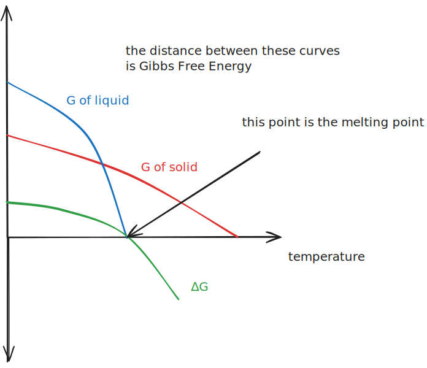
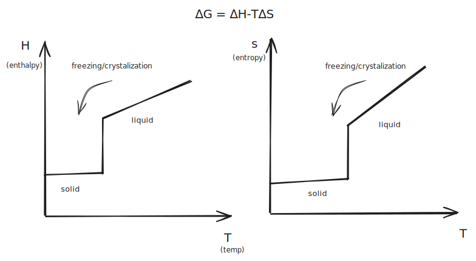
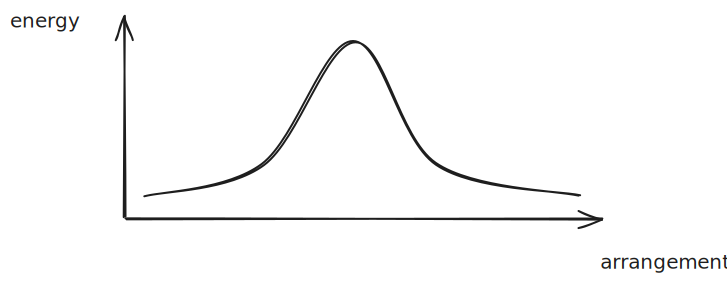
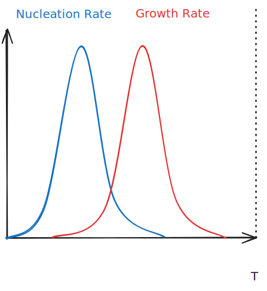
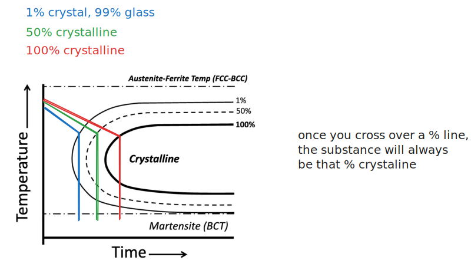

# Phases

"A homogeneous portion of a system with uniform *physical* and *chemical* characteristics"

---

A phase is made up of **components**. A component is a pure element and/or compound of which a material is composed. For instance, graphite has only one component because it is made of only carbon.

Components are parts of a phase.

Sodium (NaCl) has one component (NaCl, which is a compound), and if the crystal is homogeneous throughout, it will have a single phase.

> 🤖 (notecheck comment) - The text here refers to "Sodium (NaCl)" as though sodium and sodium chloride are the same substance. Sodium is the element Na, while NaCl is sodium chloride, so it would be clearer to write “sodium chloride (NaCl)” instead of “Sodium (NaCl).”

Generally, *a solution that is mixed at the molecular level is a singular phase.*

### Solid Solutions

Solid solutions are randomly arranged but have a uniform mixture. This random, Gaussian arrangement is considered uniform. Thus, a solid solution like steel made of multiple constituent elements will be a single phase, even though the arrangement of those atoms is amorphous.

> 🤖 (notecheck comment) - While steel can be a single phase, calling the arrangement of those atoms "amorphous" is incorrect. Steel typically forms a crystalline lattice, though the distribution of solute atoms is random.

Not all amorphous solids are single phase, however. Where there are solid-state precipitates, i.e., chunks of a different substance within the solid (a type of defect), you would say that this precipitate is a different phase from the rest of the metal.

### Two-Phase Glasses

Substances with the same composition can have two different phases. If one section is amorphous and one section is crystalline, then they are different phases, regardless of their composition.

### Thermodynamics of Phase Change

*Gibbs Free Energy* is a quantity that describes if something is spontaneous. In nature, $∆G$ is low.

> I should know what this is, I think there's a chapter in my thermo book about this.

We want to minimize $G$ at equilibrium.

%%[🖋 Edit in Excalidraw](../../media/excalidraw/excalidraw-2024-11-26-09.55.41.excalidraw.md)%%

We can also visualize phase change with an enthalpy-temperature chart or an entropy-temperature chart.

%%[🖋 Edit in Excalidraw](../../media/excalidraw/excalidraw-2024-11-26-10.01.14.excalidraw.md)%%

### Energy Barriers
The thermodynamics will tell us if the transition is possible, but kinetics can differentiate if the change is actually practical.

There are some **energy barriers** that prevent a phase transformation.

#### Atomic Motion / Diffusion
Atoms need to be able to move to change phase. This means that you have to *break bonds* and distort lattices, meaning that energy is required.

%%[🖋 Edit in Excalidraw](../../media/excalidraw/excalidraw-2024-11-26-10.11.22.excalidraw.md)%%

$$D = D_o exp(-\frac{E_{hop}}{kT})$$ 
where:
- $D$ is the diffusion rate
- $T$ is temperature

#### Interface/Surface Formation

An interface is the boundary between a liquid and a solid. The small portion that starts to solidify is the *nucleus*, which is where solidification begins. A phase will *nucleate* and then grow bigger. This is how *grains are formed*; different nuclei grow outward until they bump into other growing nuclei, where they form the boundary.

The interface is an energy barrier that raises the energy with broken bonds and strained bonds. (what?????)

> this class drives me insane, dude

%%[🖋 Edit in Excalidraw](../../media/excalidraw/excalidraw-2024-11-26-10.24.22.excalidraw.md)%%

There is a spot in the middle where nucleation is high enough for diffusion but not too high to lose nucleation.

Faster nucleation tends to produce smaller grains.

## Time-Temperature-Transformation (TTT) Diagram

%%[🖋 Edit in Excalidraw](../../media/excalidraw/excalidraw-2024-11-26-10.33.03.excalidraw.md)%%

> You apparently only really need to look at where the intersection is