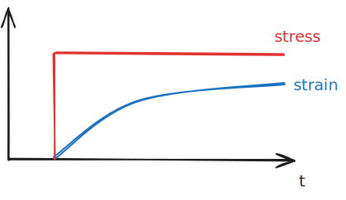
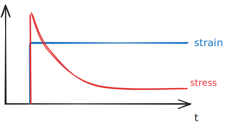
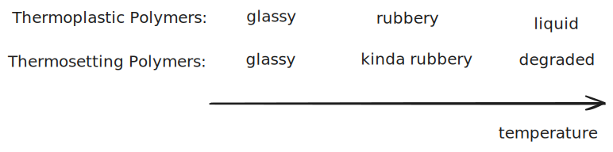

# Structure of Polymers

Polymers are chains of repeat units called **monomers**. This is the polymer's SRO.

There are a few types of polymers:
- **homopolymers** are attracted to men and repeat the same unit
- **copolymers** have different repeat units
	- **block copolymers** have alternating "blocks" of two units
	- **statistical copolymer** has random switching between two units

### Side Groups

Side groups hang off of the polymer backbone:

### Polymer Structure

#### Tacticity 

Tacticity describes the arrangement of the side groups in a polymer.

Some types are
- **Atactic**
	- randomly arranged
	- non-dense packing
	- hard to crystalize
- **Isotactic**
	- same-side arranged
- **Syndiotactic**
	- every-other monomer; alternating

#### Architecture

A grafted architecture has two polymers; the main chain is one type and the "branches" are another type. This is different from comb or branched, where all the polymers are the same.

#### Molecular Weight

The molecular weight of a polymer depends on the structure of the polymer—not just the stoichometry.

> This quantifies the weight/mass per mole of polymer strands. Because there are so many molecules in each **macromolecule** polymer strand, these weights are huge. For instance, polystyrene can have a molecular weight of 100,000–400,000 g/mol ([Wikipedia](https://en.wikipedia.org/wiki/Polystyrene#Production)).

You can calculate the **number average** molecular weight, which is the *average number of monomers per chain, times the monomer weight*.

$$ M_n = \frac{\sum M_iN_i}{\sum N_i}$$

You can also calculate the **weight average** molecular weight, which accounts for the fact that larger elements make up more weight of the polymer sample:

$$M_w = \frac{\sum M_i^2N_i}{\sum M_iN_i}  $$

A higher molecular weight will usually correspond to:
- higher elastic modulus
- higher toughness
- higher service temperature
- higher tensile strength
- higher chemical resistance.
- lower glass transition temperature (???)

The inverse is true for lower molecular weights.

**Side groups** may influence the molecular weight of an object, in turn influencing the properties listed above. 

### Cross Linking

**Chemical cross links** entail *covalent bonds* between two polymer chains. An example of this is natural rubber.

**Physical cross links** entail ionic/hydrogen bonds between polymer chains. An example of this is synthetic rubber

Cross links increase the strength and rigidity of the material.

## Time Dependency

Some properties of polymers, such as their stress-strain curve, are dependent on time. 

**Viscoelasticity** refers to how polymers elasticity is somewhat liquid like.

The **Deborah number** quantifies the "time scale of deformation." The *lower* the Deborah number is, the *faster* a material will change. (????)

> Doesn't make much sense so far.

$$ De = \frac{time\ of\ relaxation}{time\ of\ observation}$$

**Creep** quantifies how, with a constant stress applied, strain may change with time:

%%[🖋 Edit in Excalidraw](../../media/excalidraw/excalidraw-2024-11-10-17.02.17.excalidraw.md)%%

**Stress relaxation** quantifies how stress will decrease with time after a strain is applied:

%%[🖋 Edit in Excalidraw](../../media/excalidraw/excalidraw-2024-11-10-17.04.04.excalidraw.md)%%

^ This differs from an elastic material, which has constant stress to maintain strain. Think of a rubber band vs silly putty; the rubber band will continue tugging, but the silly putty won't.

#### Glass Transition in Polymers

A polymer will be rubbery until its below its glass transition temperature, where it becomes glassy.

Below the glass transition temperature, everything becomes glassy. 

## Thermosets vs Thermoplastics

Thermosets have a **high degree of crosslinking**. This causes thermosets to be tough but brittle.

Thermoplastics have less cross-linking, which allows them to be melted and remelted. Thermosets degrade under high temperatures before melting. 

Thermoplastics can be recycled, whereas thermo sets cannot (at least for now).

%%[🖋 Edit in Excalidraw](../../media/excalidraw/excalidraw-2024-11-10-17.17.11.excalidraw.md)%%

