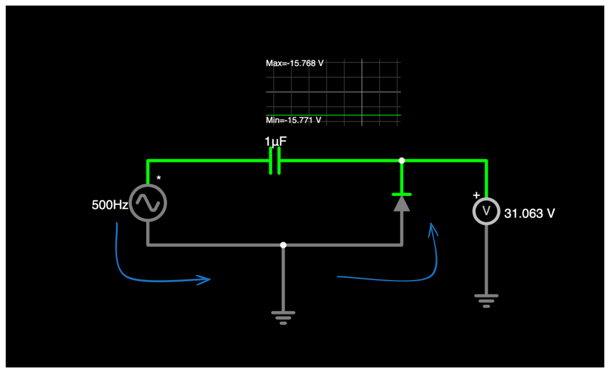
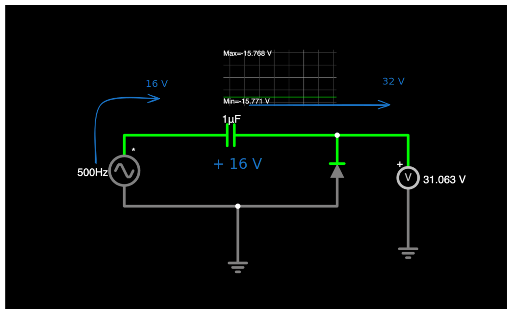
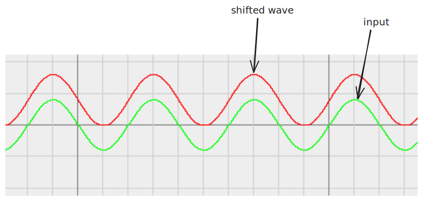
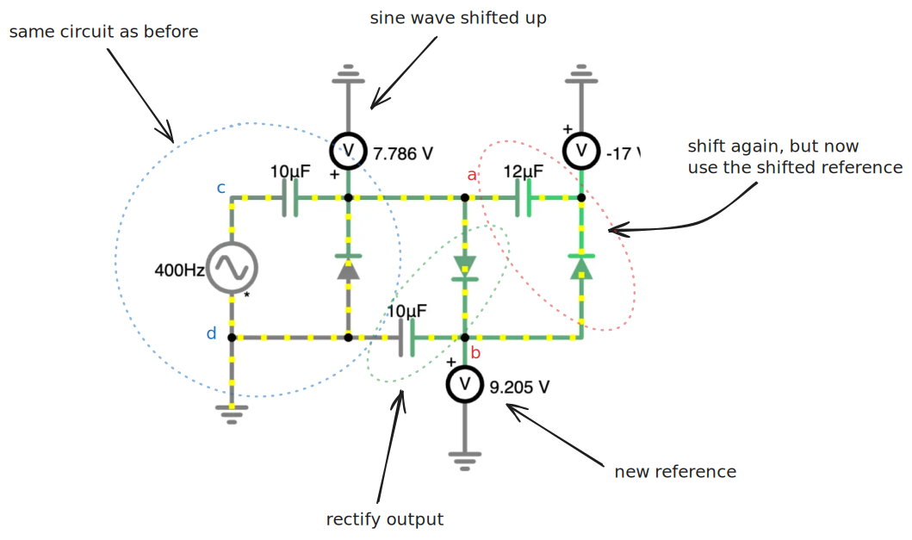
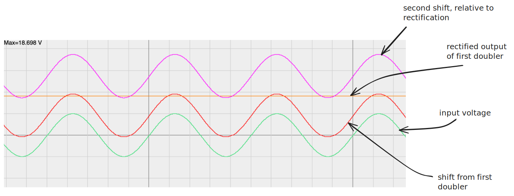

# Cockcroft-Walton multipliers

Often called a CW generator / CW multiplier

---

## Voltage Doubler
Consider this circuit.

In the first part of the ac wave, voltage flows through the diode, shown below.

%%[🖋 Edit in Excalidraw](excalidraw-2024-11-17-20.53.56.excalidraw.md)%%

This action *charges the capacitor* to the voltage of the source.

Now, when the polarity of the source switches, the charged capacitor's voltage sums with the source voltage:

%%[🖋 Edit in Excalidraw](excalidraw-2024-11-17-20.56.31.excalidraw.md)%%

This effectively doubles the voltage of the input by shifting the sine wave up:

%%[🖋 Edit in Excalidraw](excalidraw-2024-11-17-20.58.17.excalidraw.md)%%

## CW Multiplier

Now, we can add onto this base circuit:

%%[🖋 Edit in Excalidraw](excalidraw-2024-11-17-21.59.52.excalidraw.md)%%

Our elementary circuit shifts the sine wave up, making the peak 2x what it was. This base circuit is **shown in blue**. As shown in the [waveform above](excalidraw-2024-11-17-20.58.17.excalidraw.svg), the output of this circuit is a *shifted sine wave*.

We *rectify this shifted sine wave* with the circuit **shown in green** using a simple diode and capacitor. The result of this is a DC output with voltage of the blue doubler.

Next, we add another doubler, *identical to the one in blue* to the circuit—**shown in red**. Between points a and b, the waveform is similar to the voltage between c and d. **The main difference is that the wave is now relative to 9V** (in this case) **instead of ground.**

%%[🖋 Edit in Excalidraw](excalidraw-2024-11-17-22.09.52.excalidraw.md)%%

We can continue this pattern, by rectifying the second shift, adding a third doubler, and so on. Eventually, the circuit looks like:

You can continue to add doublers and rectifiers until the voltage increases massively. In this example the $5VAC$ is converted into $65VDC$. 

## Power Draw

> I need to figure how much current I could realistically draw from something like this.

## References
1. https://www.youtube.com/watch?v=ljUmDU4Uzp8
2. 