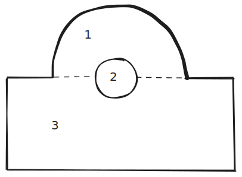

# Statics HW 8 confused

%%[🖋 Edit in Excalidraw](../media/excalidraw/excalidraw-2024-11-08-15.02.27.excalidraw.md)%%

For the half circle at 1:

$$I_{1a} = \frac{πR^4}{8} + \left(\frac{1}{2}πR^2\right)(h)^2 \approx 326.7 \, in^4$$

For the whole circle at 2:

$$I_{2a} = \frac{πr^4}{4} + (πR^2)(h)^2 \approx 125.7 \, in^4$$

> 🤖 (notecheck comment) - In the second formula, there is an inconsistency: r is used for the circle's radius in the term πr⁴/4, while R is used for the area term πR². These should match if they refer to the same circle's radius.

For the rectangle at 3:

$$I_{3a} = \frac{bh^3}{12} + (bh)\left(\frac{h}{2}\right)^2 = 117 \, in^4$$

Then, for the total area moment of inertia,

$$I_a = I_{1a} - I_{2a} + I_{3a} = 318 \, in^4$$