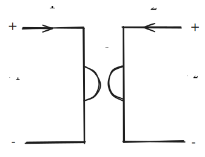
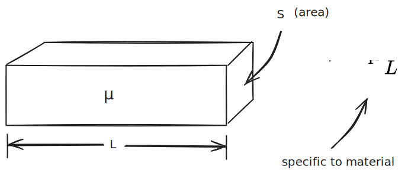

The Gyrator-Capacitor model (AKA the *capacitor-permeance model*) is another type of [Magnetic Circuit](Magnetic%20Circuits%20(Resistance-Reluctance).md) model. As *opposed* to the **resistance-reluctance model** the Gyrator-Capacitor model makes permeance analogous to electrical capacitance. 

The primary advantage of the Gyrator-Capacitor model is that **energy is accounted for**—whereas the resistance-reluctance model falls short.

In the gyrator capacitor model, the **Magnetomotive force**, discussed more in [Magnetic Circuits (Resistance-Reluctance)](Magnetic%20Circuits%20(Resistance-Reluctance).md), is still:

$$ \mathcal F = \int \textbf H \cdot d \vec l $$

However, wherein the *resistance reluctance model* magnetic flux $\Phi$ is analogous to current, the *magnetic flux $\Phi$ in the gyrator capacitor mode is analogous to charge.* Accordingly, the flux rate of change $\dot \Phi$ is analogous to current—the charge rate of change.

## Gyrator

A gyrator is a two-port element, meaning it has two pairs of terminals. Voltage one one port will transform/control the current on the other port, and the same is true in reverse.

%%[🖋 Edit in Excalidraw](../media/excalidraw/excalidraw-2024-11-10-21.06.50.excalidraw.md)%%

In a Gyrator:

$$V_1=RI_2,\ \ V_2=RI_1$$

In the gyrator-capacitor model, **the gyrator acts as a transducer between electrical energy and magnetic energy**.

>  A transducer is just something that converts one form of energy into another

*An electric emf is analogous to an magnetic mmf in this model*. 

> I'd like to look into gyrators more. It looks like they're used in op-amps, but I don't understand their fundamental purpose nor their means of operation.

### Magnetic Voltage

Magnetic voltage is an *alternative name for MMF*; they are one and the same. The MMF is expressed in a few different ways:

$$ MMF = v_m = \mathcal F = - \int \limits _A^B \textbf H \cdot d \vec l $$
### Magnetic Current

There is also a magnetic current in an electromagnetic field, which is an entirely different subject.

In this model, magnetic current $i_m$ is just the time derivative of magnetic flux:

$$ i_m = \dot \Phi = \frac{d}{dt} \iint_s\textbf B \cdot dS$$

This magnetic current if different from that used in the resistance-reluctance model, which is the primary difference between the two.

### Magnetic Capacitance

Magnetic capacitance is *another name for permeance*; again, they are one and the same. ~~Permanence in the gyrator-capacitor model is not the same as permanence in the resistance-reluctance model.~~

Magnetic capacitance is expressed in a few different ways:

$$C_M = \mathcal P = \frac{\iint_S \textbf B \cdot dS}{\int _C \textbf H \cdot d \vec l} = \frac{\Phi}{\mathcal F}$$

For a bar of uniform cross section, the magnetic permanence is:

%%[🖋 Edit in Excalidraw](../media/excalidraw/excalidraw-2024-11-10-21.24.52.excalidraw.md)%%

### Magnetic Inductance

Inception. woah. This isn't the same as magnetic induction, it's the analogy for these magnetic circuits.

The magnetic inductance is:

$$ x_L = \omega L_M$$

or in its complex form:

$$ jx_L = j\omega L_M$$

where:
- $x_L$ what is this 😭😭
- $\omega$  is the angular frequency of the magnetic circuit
- $L_M$ is the magnetic inductance

### lost me

You can go deeper into the complex stuff with magnetic impedance and stuff, but I just wanna build a flyback transformer at the end of the day, so I might pick this up at a later date.

## References
1. [Wikipedia](https://en.wikipedia.org/wiki/Gyrator%E2%80%93capacitor_model)
