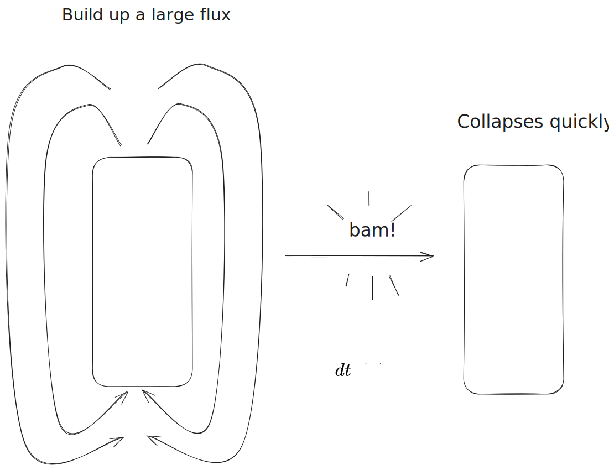
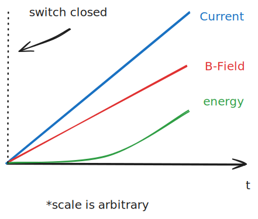
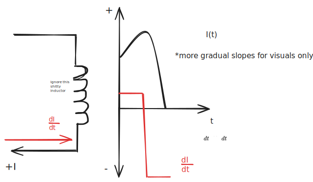

# Flyback Transformers

Flyback transformers were developed in order to drive high voltage CRTs for early televisions. "Unlike conventional transformers, a flyback transformer is not fed with a signal of the same waveshape as the intended output current." (1)

## Principle

The primary side of the flyback transformer is *driven by a switched DC supply*.
> Would this be a square wave, does it depend?

While the switch is on, current begins to flow through the primary winding, as is shown above. The *inductance of the primary causes the current to ramp up*.

"An integral *diode connected in series with the secondary* winding prevents the formation of a secondary current that would eventually oppose the primary current ramp." (1) So you end up having an inductor, magnetically charged, with nothing else to induce an emf in. 

Then, the switch on the primary is opened and the current falls to zero. The **magnetic field around the primary quickly collapses**, creating a spike in magnetic flux rate, causing a sharp voltage spike in the secondary winding.

%%[🖋 Edit in Excalidraw](../../media/excalidraw/excalidraw-2024-11-07-20.55.35.excalidraw.md)%%

The voltage spike rises until the load limits it, and then the current dies down like a ramp.

This cycle is repeated. If the current in the secondary drops to zero, the transformer is said to operate in *discontinuous mode*. If the current never reaches zero, then it's in *continuous mode*. 

### [Falstad Circuit POC](https://tinyurl.com/228kms9j)

This not-so-realistic Falstad simulation shows how the secondary voltage can peak to insane values the moment after the switch is opened.  

## Physical Considerations

#### Ferrite Cores

*The permeability of ferrite is larger than iron*, which is used in most power transformers. From the [Resistance-Reluctance model](../../independent%20study/electromagnetism/Magnetic%20Circuits%20(Resistance-Reluctance).md), it is seen that the reluctance in the magnetic circuit is inversely proportional to permeability:

 $$\mathcal R = \frac{l}{\mu A} $$

This means that a ferrite core can "conduct" the magnetic field better than a iron core.

> If this is the case, why would anyone use iron? It looks like iron has a higher satirization than ferrite—maybe that's why?
> Ok, yeah it is bc saturation.

For future reference, once a transformer core becomes saturated, its reluctance skyrockets and it effectively looses the ability to contain more any extra flux. The transformer incurs large losses after this point.

#### Air Gaps

Air gaps "store energy in the magnetic circuit." The energy per unit volume stored in a magnetic field is:

$$u = \frac12 \frac{B^2}{µ}$$

We use ferrite to concentrate the magnetic flux density ($B$) over the air gap, which has a relatively low permeability. This low permeability allows a large energy per unit volume to be stored. A high permeability material would also saturate far too quick to store any significant energy.

The reason we don't use a low-permeability core is because $B$ needs to be concentrated for the energy storage to be significant. Using a low-permeability material for the entire core would also mean that a lot of flux would leak out of the magnetic circuit.

These air gaps also increase the reluctance enough such that the core won't saturate.

#### Closer look at mechanism

> might want to move this section

When the switch is initially closed, the inductance of the primary prevents current from flowing instantaneously. Instead, the current slowly ramps up. As it ramps up, the B-field it creates proportionally increases, and the energy stored in the air gap increases too:

%%[🖋 Edit in Excalidraw](../../media/excalidraw/excalidraw-2024-11-11-21.04.09.excalidraw.md)%%

When the switch is opened, the change in current, which is proportional to the change in magnetic flux $\dot \Phi$ is massively opposite to the direction that is was pointing prior, as shown below:

%%[🖋 Edit in Excalidraw](../../media/excalidraw/excalidraw-2024-11-11-21.08.07.excalidraw.md)%%

This change in magnetic flux is felt across the entire magnetic circuit, and the energy stored in the air gap seems to "propel" this process. I think you need to use the [Gyrator-Capacitor Model](../../independent%20study/electromagnetism/Gyrator-Capacitor%20Model.md) to calculate this value.

If you *put a diode* on the secondary, you can prevent the changing flux (represented as positive in the drawing above) from inducing current in the loop. However, once the change in flux switched direction, current is allowed to flow in the reverse direction. Because *this is the only outlet for the stored energy*, a massive emf is induced in the secondary.

## References

1. [wikipedia](https://en.wikipedia.org/wiki/Flyback_transformer#History)
2. [this guy](https://www.youtube.com/watch?v=VfSc15_XjiQ&t=235s)